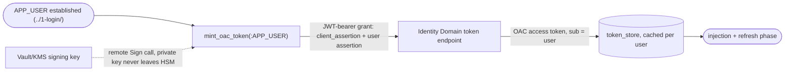

# 2-per-user-oac-token - per-user OAC token (per-user OAC token phase)

Builds on `../1-login/`. Once login establishes `:APP_USER`, this phase mints a
per-user, on-behalf-of (OBO) **OAC** token whose subject is that same user, and caches
it - so the target enforces the user's own authorization, not a shared service
account's. `../3-token-injection-and-refresh/` then injects that token into the agent
call and keeps it fresh.

This sample uses a **single identity domain** for both SSO login and per-user token
minting - the confidential application from `../1-login/` is extended (step 4) rather
than a second domain being introduced. The signing key used to mint the token never
leaves OCI Vault/HSM - all signing happens through remote calls to OCI KMS.

## Prerequisites

- `../1-login/` already working - `:APP_USER` established after SSO login.
- Access to the OCI Console with permission to create a Vault, a Vault key, a system
  user, and IAM policies.
- Access to the identity domain's confidential application from `../1-login/` (or
  permission to create a second one - see step 4).
- The OAuth scope OAC's API requires for downstream access.
- Local: Python 3 + `pip`, and the OCI CLI configured with a profile authenticated
  through `oci session authenticate` (a security-token profile, not a static API key) -
  used once, locally, to generate a certificate.

## Flow

## Steps

| Step | File |
|------|------|
| 1 | [setup/1-system-user-and-api-key.md](setup/1-system-user-and-api-key.md) - dedicated system user + OCI API key |
| 2 | [setup/2-vault-and-kms-key.md](setup/2-vault-and-kms-key.md) - the Vault/KMS signing key |
| 3 | [setup/3-self-signed-certificate.md](setup/3-self-signed-certificate.md) - self-signed cert wrapping the Vault key's public key |
| 4 | [setup/4-confidential-app-jwt-assertion.md](setup/4-confidential-app-jwt-assertion.md) - Trusted client, certificate, "on behalf of", OAC scope |
| 5 | [setup/5-apex-web-credential-oci.md](setup/5-apex-web-credential-oci.md) - APEX Web Credential authenticating KMS Sign |
| 6 | [setup/6-database-grants-and-acls.md](setup/6-database-grants-and-acls.md) - ADMIN-only grants and Network ACLs |
| 7 | [setup/7-database-objects.md](setup/7-database-objects.md) - `jwt_util`, `token_store`, `mint_oac_token` |
| 8 | [setup/8-application-process-mint-token.md](setup/8-application-process-mint-token.md) - mint the token automatically on login |

## Handoff

After step 8, `token_store.get_token(:APP_USER, 'oac')` returns a cached, per-user OAC
token for the rest of the session, re-minting on demand if expired or missing. The
injection + refresh phase (`../3-token-injection-and-refresh/`) reads from this same
store - it does not care how the token was minted, only that `token_store` can produce
one.
