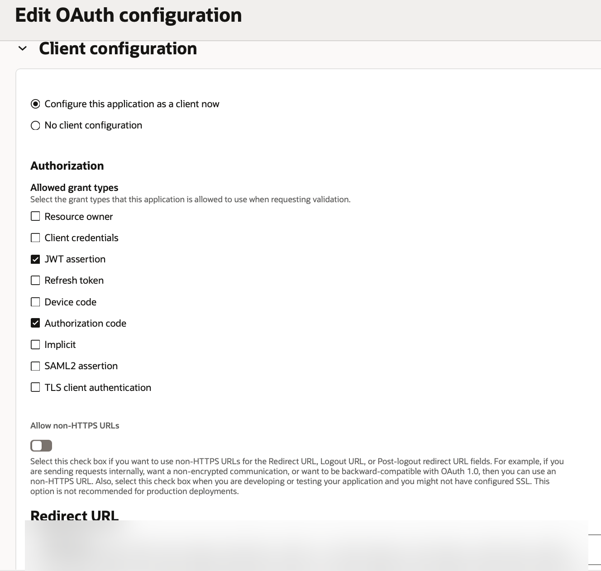
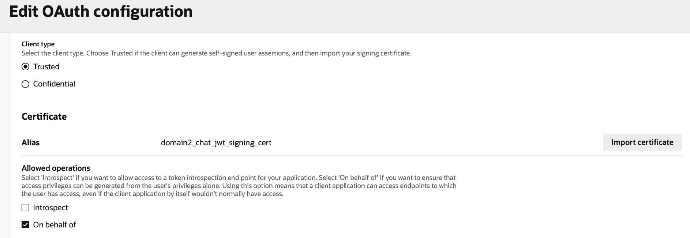

# Step 4 - Enable JWT assertion on the confidential application

This sample uses a **single identity domain** for both login and per-user token
minting - so this step extends the *same* confidential application `../../1-login/`
created (rather than creating a second one), adding the "Trusted client" / certificate /
"on behalf of" configuration that phase 1's app didn't need.

> If you'd rather keep the two concerns fully separate, you can instead create a
> **second** confidential application in the same domain and follow this step there -
> everything below still applies, just against a different app. There's no requirement
> either way; this guide defaults to reusing the one app since it's one fewer thing to
> register and track.

1. Open the confidential application from `../../1-login/setup/1-identity-domain-confidential-app.md`
   -> **OAuth configuration** tab -> **Edit**.
2. Under **Authorization -> Allowed grant types**, add **JWT assertion** (keep
   **Authorization code** checked too - the app now serves both login and OBO minting).
   Set the **Redirect URL** to your APEX callback if it isn't already set from phase 1:

   

3. Set **Client type = Trusted** - its own description says: *"Choose Trusted if the
   client can generate self-signed user assertions, and then import your signing
   certificate"* - exactly what we're doing.
4. **Import certificate**, using the file (not copy-pasted text) produced in step 3.
5. Give it an **Alias** - record this exact string; it's used as the JWT `kid` header
   in step 7's `mint_oac_token` procedure (e.g. `oac_chat_jwt_signing_cert`).
6. Under **Allowed operations**, check **"On behalf of"** - this is what enables
   per-user token minting from a self-signed assertion instead of an interactive login.

   

7. Under **Resources**, add the scope corresponding to the OAC API resource your agent
   needs to call downstream.
8. **Submit**, then **Activate** if prompted.
9. Record the client's **id** - `mint_oac_token` (step 7) needs it as `g_client_id`.

## Gotcha: the certificate Alias is not optional, even with only one certificate

A confidential app can only import **one** certificate - but the identity domain still
looks up which certificate to verify a JWT against by an exact string match between the
JWT's `kid` header and this registered Alias, not by "there's only one cert on this app,
so just use it regardless." A mismatch fails outright with a generic `invalid_client`
"system error," even when the underlying key material is exactly right. Whatever string
you put in `g_kid` in step 7 must equal this Alias, character for character.
