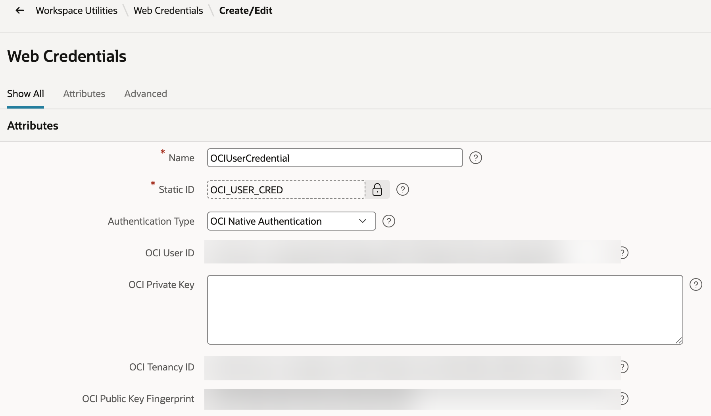

# Step 5 - APEX Web Credential for KMS Signing

Shared Components -> **Web Credentials -> Create**:

- **Authentication Type:** OCI Native
- **OCI User ID / OCI Tenancy ID / OCI Public Key Fingerprint** -> from step 1 (the
  system user's API key)
- **OCI Private Key** -> contents of the private key downloaded in step 1
- **Static Identifier:** `OCI_USER_CRED`

This credential authenticates the database's calls to KMS Sign (`jwt_util.sign_and_build`,
step 7). If your AIDP agent is deployed with **OCI request signing** (the default AIDP
Workbench auth, not OAuth), this same credential can also authenticate the agent call
itself - see `../3-token-injection-and-refresh/` for that part. If your agent instead
accepts an OAuth Bearer token for the call itself, this step should be replaced with a
Bearer-token mint process that authenticates as the end user, not the system user.

> One API key covering both KMS Sign and the agent call is the simplest working setup.
> If you want independent rotation/revocation between the two, generate a second API
> key under a separate system user scoped only to the agent invocation, and create a
> second Web Credential for it - `jwt_util.sign_and_build` always uses `OCI_USER_CRED`
> either way, since that's the one covering the Vault Sign policy.
