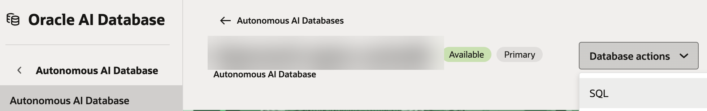

# Step 6 - Database grants and Network ACLs

Run as **ADMIN**, through **OCI Console -> your ADB -> Database Actions -> SQL**.
APEX's own SQL Commands runs as your workspace's parsing schema, which cannot run these
ADMIN-only operations.



```sql
-- Network access for: the KMS crypto endpoint and the identity domain host only.
-- (Your agent's own host is a separate ACL entry - add it wherever your agent-call
-- process lives, e.g. ../3-token-injection-and-refresh/.)
BEGIN
  DBMS_NETWORK_ACL_ADMIN.APPEND_HOST_ACE(
    host => '<vault-id>-crypto.kms.<region>.oraclecloud.com',
    ace  => xs$ace_type(privilege_list => xs$name_list('connect', 'resolve'),
                         principal_name => 'YOUR_PARSING_SCHEMA',
                         principal_type => xs_acl.ptype_db));

  DBMS_NETWORK_ACL_ADMIN.APPEND_HOST_ACE(
    host => '<identity-domain-host>',
    ace  => xs$ace_type(privilege_list => xs$name_list('connect', 'resolve'),
                         principal_name => 'YOUR_PARSING_SCHEMA',
                         principal_type => xs_acl.ptype_db));
END;
/

-- Privileges not granted to PUBLIC by default on this ADB
grant execute on dbms_crypto to YOUR_PARSING_SCHEMA;
grant execute on utl_url to YOUR_PARSING_SCHEMA;
```

`principal_name` is your APEX app's parsing schema, **uppercase** (find it under the
app's properties in App Builder).

**Verify an ACL entry actually matches** what you're calling, rather than assuming it
does:

```sql
select a.host, p.privilege, p.principal, p.is_grant
from   dba_network_acls a
join   dba_network_acl_privileges p on a.acl = p.acl
where  a.host like '%your-host-fragment%';
```

If this returns nothing, or a `host` value that doesn't exactly match, that's the
problem - not the network layer generally. A single missing/extra hostname segment
produces `ORA-12545: Connect failed because target host or object does not exist`,
which looks like a DNS or ACL failure but is actually just a wrong hostname.
