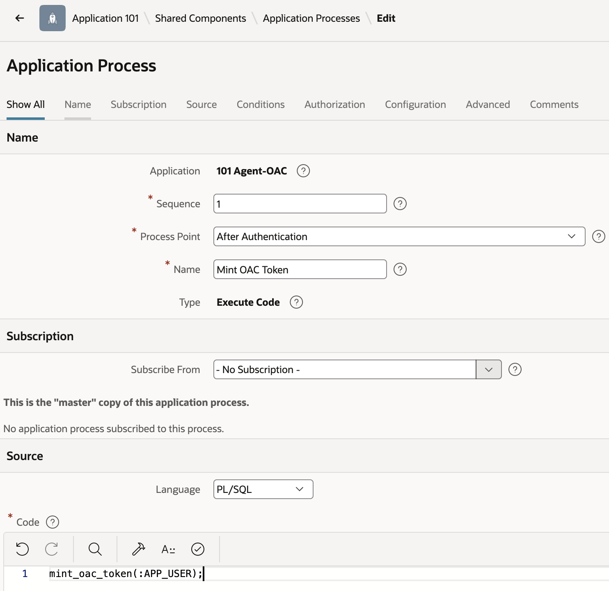

# Step 8 - Application Process: mint the OAC token on login

1. Shared Components -> **Application Processes -> Create**.
2. **Name:** `Mint OAC Token`.
3. **Process Point:** After Authentication.
4. **Process body** (Source step, Code field, Language PL/SQL):
   ```plsql
   mint_oac_token(:APP_USER);
   ```
5. **Conditionality:** Expression, Language PL/SQL - `:APP_USER != 'NOBODY'`.
6. **Save.**

   

## Handoff

After this runs, `token_store.get_token(:APP_USER, 'oac')` returns a cached, per-user
OAC token for the rest of the session (re-minting on demand if it's expired or missing).
`../3-token-injection-and-refresh/` reads from this same store to inject the token into
the agent's `/chat` call and keep it refreshed.

## Gotcha

Page Designer's **Run does not implicitly save** unsaved process code edits. If you
change this process and click Run without an explicit Save first, you'll test stale
code and get confusing errors that have nothing to do with whatever you actually just
changed - always Save, then Run.
