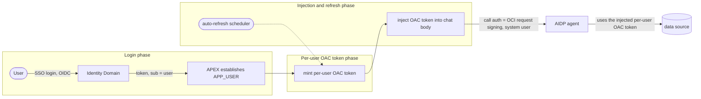

# APEX → AIDP with per-user authentication

A sample showing how an Oracle APEX app calls an AIDP AI agent, so that
every request carries that user's identity end to end (their own downstream token, their own
data) instead of a shared service account - and the token stays fresh automatically.

Note that in this sample, APEX -> AIDP authentication is done through a service account but the APEX app mints a per-user OAC bearer token after SSO login and passes the same to AIDP. The AIDP agent uses this bearer token as is to call the OAC API, so that per-user authorization can be enforced in the OAC API.

It has three phases:

1. **`1-login/` - login phase**: SSO login that signs the user in and establishes the
   end-user identity (`:APP_USER` = the `sub` claim).
2. **`2-per-user-oac-token/` - per-user OAC token phase**: on that identity, mint a per-user
   downstream (OAC) token, cached per user. *(Placeholder - filled by the per-user minting
   work; not duplicated here.)*
3. **`3-token-injection-and-refresh/` - injection + refresh phase**: inject the per-user token
   into the `/chat` request **body** as a session variable, and keep it fresh automatically so
   the chat never breaks when a token expires.

### Auth model (important)
Two different auths are at play - don't conflate them:
- **The call to the AIDP agent** is authenticated by **OCI request signing as a system user**
  (a DBMS_CLOUD OCI credential). The AIDP agent expects OCI signing here - **not** an OAuth
  Bearer token.
- **The per-user OAC token** is **not** the call's auth. It is carried **inside the `/chat`
  request body** as a session variable, and the agent uses it for its own downstream OAC access
  - which is what makes the data per-user even though the call itself is a system user.
