# Stage-level design

How the Snowflake → AIDP migrator is put together, and how a run executes.
`MIGRATION-ARCHITECTURE.md` is the companion migration design: what maps to
what, and the order a migration follows.

---

## 1. The model

The plugin is **one CLI plus a filesystem**. Every stage is a subcommand of
`engine/snowmig.py`, and stages communicate only through JSON artifacts in
`--out-dir`. There is no daemon, no session, no shared in-memory state.

```
skill / slash command  →  snowmig.py <stage>  →  --out-dir/*.json + *.md
        (agent)              (engine)                 (the contract)
```

Three consequences, all deliberate:

- **A stage is resumable and re-runnable.** Its inputs are files on disk, so a
  failed run is resumed by re-running that stage, not the pipeline.
- **The agent never holds migration state.** It reads `STAGES.md`. A new
  conversation picks up an old `--out-dir` with no handover.
- **Every claim is auditable after the fact.** The artifact is the evidence,
  and it outlives the terminal it was produced in.

### Layering

| Layer | Module | Rule |
|---|---|---|
| Source | `snowflake_source/` | Read-only, enforced at the transport. Cannot emit a non-read verb |
| Translation | `snowflake_source/dialect/` | Pure. Refuses rather than guesses |
| Planning | `plan/` | Pure and offline. Touches no network |
| Rendering | `report/` | Pure. Reads artifacts, writes markdown |
| Target | `target/` | The only layer that can write to AIDP. All I/O injected as `call` / `run_sql` |

The injected-callable convention makes the whole target layer unit-testable
offline: every AIDP behaviour the plugin relies on is covered by a regression
test that needs no environment.

---

## 2. Stage inventory

The stages. `needs` is what must be reachable; `writes` means it can
change the destination.

| # | Stage | Needs | Reads | Produces | Writes to AIDP |
|---|---|---|---|---|---|
| 0 | `preflight` | a connection config *(+ either end, to test it)* | the config file | `preflight.json`, `PREFLIGHT_CONFIG.md` | no |
| 1 | `assess` | Snowflake | — | `inventory.json`, `INVENTORY.md`, `CENSUS.md` | no |
| 2 | `deps` | Snowflake | `inventory.json` | `dependencies.json` | no |
| 3 | `maintenance` | Snowflake | `inventory.json` | `maintenance.json`, `MAINTENANCE.md` | no |
| 4 | `security` | Snowflake | `inventory.json` | `security.json`, `SECURITY.md` | no |
| 5 | `compute` | Snowflake | — | `warehouses.json`, `compute.json`, `COMPUTE_PROPOSAL.md` | no |
| 6 | `data-options` | offline | — | `data_options.json`, `DATA_MOVEMENT_OPTIONS.md` | no |
| 7 | `plan` | offline | `inventory.json`, `dependencies.json`, *(`data_options.json`)* | `plan.json`, `PLANNED_OBJECTS.md` | no |
| 8 | `ddl` | offline | `inventory.json`, `plan.json` | `ddl_plan.json`, `DDL_PLAN.md` | no |
| 9 | `smoke` | Snowflake + AIDP | — | `smoke.json`, `SMOKE_TEST.md` | **only with `--write-probe --execute`** |
| 10 | `catalog` | AIDP | — | `catalog_result_<name>.json`, `CATALOG_<name>.md` per catalog (S3 and S4 each keep theirs); `catalog_result.json`, `CATALOG.md` = the latest executed, listing every catalog registered | **yes, with `--execute`** |
| 11 | `deploy` | AIDP | `ddl_plan.json`, `plan.json`, `inventory.json` | `PREFLIGHT.md`, `deploy_result.json`, `SOFT_CLONE_SUMMARY.md` | **yes, with `--execute`** |
| 12 | `notebook` | offline | `ddl_plan.json`, `plan.json`, `inventory.json` | `*.ipynb`, `NOTEBOOK.md` | no — `--upload` is a dry run and is refused with `--execute`; the structure is created by `run --job snowmig_01_structure` |
| 13 | `summary` | offline | `plan.json`, `inventory.json`, *(`deploy_result.json`)* | `SUMMARY.md` | no |
| 14 | `provision` | AIDP | the scripts + whatever plan artifacts exist | `provision_result.json`, `PROVISION.md`, and the AIDP-side folder, drivers and jobs | **yes, with `--execute`** |
| 15 | `ingest` | offline | the S6 discovery manifest | `inventory.json` (marked as from the manifest), `dependencies.json` (`not_extracted`), `ingest_result.json` | no |
| 16 | `run` | AIDP | a job `provision` created | `run_<job>.json` (written as RUNNING at submit, rewritten at the end), `RUN_<job>.md` | **yes — no dry run: running IS the write** |
| 17 | `teardown` | AIDP | `provision_result.json`, the catalog ledger | `teardown_result.json`, `TEARDOWN.md` | **yes, with `--execute`**: clusters by default; `--scope credential` the workspace credential; `--scope all` everything the record proves this migration created (INTERNAL catalog only with `--include-data`) |
| — | `stages` | offline | everything present | `STAGES.md` | no |
| — | `demo` | offline | — | every artifact above, emulated, + `DEMO.md` | no |

Past `provision`, the work moves inside AIDP: 3 + N jobs (discover, structure,
reconcile, and one copy job per schema of the approved plan, each passing
`schema` as a task parameter) run the scripts in `data-migration-scripts/` —
self-contained `.ipynb`, generated from `engine/dataplane/` (discover →
structure → copy, schema by schema → reconcile) — and their reports land in
the workspace, not in `--out-dir`.

`stages` is not a pipeline step; it is the read-out of one.

**Seven stages write:**
- `provision`, `catalog` and `deploy` — each a dry run without `--execute`.
- The two workflows `run` starts, which have no dry run (running is the
  write): `structure-workflow` (`snowmig_01_structure`) creates the
  structure; `copy-workflow` (`snowmig_02_copy_<schema>`, one job per schema
  of the pushed plan) copies rows.
- `publish` — copies the report into the workspace; a dry run without
  `--execute`.
- `teardown` — destructive, and a dry run without `--execute`. It stops the
  clusters this migration allocated, or deletes them when asked; with
  `--scope credential` it removes the workspace credential, and with
  `--scope all` everything the migration created.
- Plus, narrowly and opt-in, `smoke --write-probe --execute`.

The stage board says exactly that, lists `provision` and `catalog` in their
dependency positions, and reads their artifacts (a `create_requested` that
has not yet become visible is flagged as pending, not success). Once a
migration is on the runbook (a provision executed, or no laptop `assess`),
its "next" follows the runbook's order (S1, S3/S4, S6, S7, S10, S12) and
never proposes a copy; a job run is recorded as RUNNING the moment it is
submitted, so the board waits on it instead of offering it, or its `deploy`
twin, again.

---

## 3. Execution graph

A migration follows the runbook's fixed order (S1–S12, in
`skills/snowflake-migrator-overview/SKILL.md`):

```
preflight                        confirm the config; test both ends
   │
provision --execute              S1 workspace · S2 migration cluster · S5 notebooks and jobs
   │
catalog --execute                S3 EXTERNAL source pointer · S4 INTERNAL target container
   │
run snowmig_00_discover          S6 discovery inside AIDP; manifest backed up
   │
ingest → plan → ddl              S7–S9 translation plan, flagged items resolved, scope approved
   │
provision --reuse-existing       plan pushed to the workspace; one copy job per schema (S11)
   │
run snowmig_01_structure         S10 schemas and empty Delta tables, each read back
   │
run snowmig_02_copy_<schema>     when the customer decides; one schema per run
   │
run snowmig_03_reconcile         MIGRATION_REPORT.md
   │
teardown                         release the compute (or --scope credential | all)
```

The stages that run on the operator's machine against Snowflake —
`assess`, `deps`, `maintenance`, `security`, `compute` — and the offline
`data-options` are previews and advisory reports: they inform the plan and
gate nothing. `smoke` is the exception: it checks both ends are reachable
with the permissions the next step needs.

`deploy` is a separate path, used only when the user asks for it by name:
it creates the structure in a Standard catalog through the control-plane
API, reading every create back. It resolves the target's `catalogType`
before its first create and refuses an EXTERNAL target, an absent catalog
or an unreadable listing. The runbook path is the structure workflow.

### Phase diagram

Generated from the stage list in the engine (`bin/snowmig stages --write-diagram` refreshes it). Solid arrow = next phase, thick = into a phase that writes to AIDP, dotted = alternative path.

```mermaid
flowchart TB

  subgraph PHASE_SETUP["Setup &nbsp;&#40;environment and catalogs&#41;"]
    direction TB
    PREFLIGHT["<b>preflight</b><br/><i>operator machine -> Snowflake + AIDP control plane</i>"]
    PROVISION["<b>provision</b><br/>runbook S1 S2 S5<br/><i>AIDP control-plane API (no cluster)</i>"]
    CATALOG["<b>catalog</b><br/>runbook S3 S4<br/><i>AIDP control-plane API (no cluster)</i>"]
  end

  subgraph PHASE_DISCOVERY["Discovery &nbsp;&#40;read-only against Snowflake&#41;"]
    direction TB
    ASSESS["<b>assess</b><br/>runbook S7 (views)<br/><i>operator machine -> Snowflake (read-only)</i>"]
    INGEST["<b>ingest</b><br/>runbook S7<br/><i>operator machine (offline)</i>"]
    DEPS["<b>deps</b><br/><i>operator machine -> Snowflake (read-only)</i>"]
    MAINTENANCE["<b>maintenance</b><br/><i>operator machine -> Snowflake (read-only)</i>"]
    SECURITY["<b>security</b><br/><i>operator machine -> Snowflake (read-only)</i>"]
    COMPUTE["<b>compute</b><br/>runbook S12<br/><i>operator machine -> Snowflake (read-only)</i>"]
    DISCOVER_WORKFLOW["<b>discover-workflow</b><br/>runbook S6<br/><i>migration cluster (provisioned at S2)</i>"]
  end

  subgraph PHASE_PLANNING["Planning &nbsp;&#40;offline, no network&#41;"]
    direction TB
    DATA_OPTIONS["<b>data-options</b><br/>runbook S11<br/><i>operator machine (offline)</i>"]
    PLAN["<b>plan</b><br/>runbook S7-S9<br/><i>operator machine (offline)</i>"]
    DDL["<b>ddl</b><br/>runbook S7<br/><i>operator machine (offline)</i>"]
  end

  subgraph PHASE_TARGET["Target &nbsp;&#40;AIDP structure and data plane&#41;"]
    direction TB
    SMOKE["<b>smoke</b><br/><i>AIDP control-plane API (no cluster)</i>"]
    STRUCTURE_WORKFLOW["<b>structure-workflow</b><br/>runbook S10<br/><i>migration cluster (provisioned at S2)</i>"]
    DEPLOY["<b>deploy</b><br/>runbook S10 (catalog API)<br/><i>AIDP control-plane API; --transport sql uses the configured aidp.cluster_id</i>"]
    COPY_WORKFLOW["<b>copy-workflow</b><br/>runbook S11<br/><i>migration cluster (provisioned at S2)</i>"]
    RECONCILE_WORKFLOW["<b>reconcile-workflow</b><br/>runbook S11<br/><i>migration cluster (provisioned at S2)</i>"]
    NOTEBOOK["<b>notebook</b><br/><i>operator machine (offline)</i>"]
  end

  subgraph PHASE_REPORTING["Reporting"]
    direction TB
    SUMMARY["<b>summary</b><br/>runbook S9 S12<br/><i>operator machine (offline)</i>"]
    PUBLISH["<b>publish</b><br/><i>AIDP control-plane API (no cluster)</i>"]
    TOKENS["<b>tokens</b><br/><i>operator machine (offline)</i>"]
  end

  subgraph PHASE_TEARDOWN["Teardown &nbsp;&#40;release or remove what the migration created&#41;"]
    direction TB
    TEARDOWN["<b>teardown</b><br/><i>AIDP control-plane API (no cluster)</i>"]
  end

  PREFLIGHT --> ASSESS
  ASSESS --> INGEST
  INGEST --> DEPS
  DEPS --> MAINTENANCE
  MAINTENANCE --> SECURITY
  SECURITY --> COMPUTE
  COMPUTE --> DATA_OPTIONS
  DATA_OPTIONS --> PLAN
  PLAN --> DDL
  DDL --> SMOKE
  SMOKE ==> PROVISION
  PROVISION ==> CATALOG
  CATALOG --> DISCOVER_WORKFLOW
  DISCOVER_WORKFLOW ==> STRUCTURE_WORKFLOW
  STRUCTURE_WORKFLOW ==> DEPLOY
  DEPLOY ==> COPY_WORKFLOW
  COPY_WORKFLOW --> RECONCILE_WORKFLOW
  RECONCILE_WORKFLOW --> NOTEBOOK
  NOTEBOOK --> SUMMARY
  SUMMARY ==> PUBLISH
  PUBLISH --> TOKENS
  TOKENS ==> TEARDOWN
  ASSESS -. or .- INGEST
  STRUCTURE_WORKFLOW -. or .- DEPLOY

  classDef local fill:#eef6ff,stroke:#5b8dd9,color:#12314f
  classDef writer fill:#fff1e6,stroke:#d98b3a,color:#5a3410
  classDef optional fill:#f2f2f2,stroke:#888,color:#222,stroke-dasharray: 4 3
  classDef done fill:#e8f6ea,stroke:#3c9a4c,color:#173d1e
  classDef attention fill:#fdeaea,stroke:#c94343,color:#4d1414

  class ASSESS,DEPS,MAINTENANCE,SECURITY,COMPUTE,PLAN,DDL,SMOKE,NOTEBOOK,SUMMARY local
  class PROVISION,CATALOG,STRUCTURE_WORKFLOW,DEPLOY,COPY_WORKFLOW,PUBLISH,TEARDOWN writer
  class PREFLIGHT,INGEST,DATA_OPTIONS,DISCOVER_WORKFLOW,RECONCILE_WORKFLOW,TOKENS optional
```

<!-- phase-diagram:begin -->

<!-- phase-diagram:end -->

### EXTERNAL and INTERNAL catalogs

| | EXTERNAL (S3) | INTERNAL (S4) |
|---|---|---|
| Role | A read-only pointer at the live Snowflake database | The migration's target: managed Delta tables in AIDP storage |
| Data | Copies nothing | Rows arrive only through the per-schema copy jobs |
| Created by | `catalog --execute` | `catalog --catalog-type standard --execute` (the container); its schemas and tables by the structure workflow at S10 |
| Removed by | `teardown --scope all` | `teardown --scope all --include-data` |

The runbook creates both. Outside the runbook, the stand-alone `catalog`
command registers an EXTERNAL catalog by default and creates an INTERNAL
one only when asked.

---

## 4. The invariants

The rules the design holds everywhere.

**I1 — The source is read-only, at the transport and by grant.**
`snowflake_source/conn.py` refuses any statement not led by `SELECT`, `SHOW`,
`DESCRIBE` or `EXPLAIN` (or a CTE ending in `SELECT`), so no statement the
plugin builds can be a write. The gate reads the verb, not the whole
statement, so the migration's read-only role is still what prevents writes.

**I2 — Read back and compare; a 2xx is not the claim.** AIDP catalog creates
are asynchronous: they return **202 Accepted** with an empty body and no
work-request id to wait on, and the object becomes visible once the work
completes. Verification is therefore: poll with a bounded backoff, resolve the
key from the server, `GET` the object, compare the field list. "The planned
columns are there" is the claim. `ensure_catalog` polls the same way; a
listing that fails mid-poll counts as "not visible yet", because it is not
evidence either way.

**I3 — "Could not look" never renders as zero.** An unreadable `ACCOUNT_USAGE`
reports `measured: false` with null counts, because *0 reclustering credits*
and *we could not check* lead to opposite decisions. Same for unreadable
scopes in the census and unresolvable policy references. The rule has a
second half: a verdict may not name a kind that was never enumerated. A
sentence like "no aggregation policy is attached" is only true if
`SHOW AGGREGATION POLICIES` was issued and answered; the security report
builds its clean sentence from the kinds that actually answered and names
the rest as not enumerated. And there is a third state between counted
and unreadable: *not distinguishable*, when rows were read and counted
under their parent kind but the column that tells a UDTF from a UDF, or
an external stage from an internal one, could not be read. That is
reported as such, never folded into either neighbour.

**I3a — Ask the source that can answer, not the one that is convenient.**
Two sources answer "what is attached to this object": the account-wide
`ACCOUNT_USAGE` views, one statement for the estate but up to ~2 hours stale
and gated behind `IMPORTED PRIVILEGES ON DATABASE SNOWFLAKE`; and the
`INFORMATION_SCHEMA` table functions, one round trip per object, current, and
needing no extra grant. Both are read and UNIONed, each attachment says which
source saw it, and a row only the stale one has is marked for confirmation
rather than believed or dropped. Where the per-object read cannot run —
denied, or an estate over the budget for one round trip per object — the
account-wide verdict and its staleness note stand, and the report says which
case produced the number.

**I4 — Refuse rather than guess.** An unmappable type, an unknown OCI region,
a `LISTAGG … WITHIN GROUP`, a `::` cast over an expression: all raise. A
guessed value produces an object that silently differs from the plan, and the
structure probe then reports a mismatch it cannot explain.

**I5 — Nothing is chosen on the user's behalf.** Target coordinates may come
from the one migration config (`snowmig-config.yaml`), but never *silently*:
the CLI prints the file it read and the destination it took from it before
anything acts on them, and a write still needs `--execute`. `target/coords.py`
performs no I/O at all — it cannot discover a destination, only be handed one —
so a stale config can misdirect a run only in plain sight. Nothing is read from
the environment or a cache. The architecture options are presented in full with
`A6_CUSTOMER_DEFINED` as an open slot, and a customer design is recorded
verbatim, never mapped onto one of ours. One catalog per run: a multi-database
estate needs one approval each.

**I6 — Say where the run stands, unprompted.** After every stage the agent
reports the stage's real result, the board's `next_stage`, and the concrete
command that runs it. Pending is pending — never rounded up to success.

---

## 5. Gates

A gate is a point where the run stops and does not proceed on its own.

| Gate | Where | Condition |
|---|---|---|
| **Target collision** | `plan` | Two source objects fold to one target name (`ORDERS` / `"orders"`). Exits `HALT`. AIDP stores identifiers in lower case, so the two would map to one object |
| **Unmappable type** | `ddl` | `GEOGRAPHY`/`GEOMETRY` block their table unless the operator opts into `string` or `wkt`. `VARIANT`/`OBJECT`/`ARRAY` are carried as `STRING` by default, with a warning (`--semi-structured block` refuses them); either way the typed design is deferred, not replaced |
| **`timestamp_ntz`** | `ddl` | The target catalog does not take `timestamp_ntz` as a column type. Mapped to `TIMESTAMP` by default, with the timezone caveat recorded on the field; `--timestamp-ntz preserve` keeps it, and `ddl` then halts (exit 3) |
| **Connectivity** | `smoke` | Both ends reachable with the permissions the next stage needs. The write probe is skipped, with a note, against an EXTERNAL catalog — read-only by design is not a FAIL |
| **`--execute`** | `catalog`, `deploy`, `provision`, `teardown`, `publish`, `smoke --write-probe`, `notebook --upload` | Dry run otherwise. Nothing reaches AIDP without it, except `run`, `jobs --register` and the opt-in per-stage report publish (`reporting.publish_each_stage`). `notebook --upload` stays a dry run: with `--execute` it is refused, and the structure is created by `run --job snowmig_01_structure` |
| **EXTERNAL target** | `deploy` | The target's `catalogType` is resolved before the first create; EXTERNAL, absent, or unreadable → **refused** |
| **Managed catalog** | `catalog` | `--catalog-type standard` creates the CONTAINER only (sent as `INTERNAL`; `STANDARD` is accepted as an alias and normalised) and returns `container_only`. Its **tables** are created by the structure workflow (`run --job snowmig_01_structure`, S10), not here |
| **Explicit request** | skill layer | A Standard catalog requires the user to have asked, in words |
| **Provenance** | `teardown` | Only what `provision_result.json` (`created: true`) and the catalog ledger (`action: created`) prove this migration created is stopped or deleted; an adopted workspace or cluster and a reused catalog are listed as left alone |
| **Data loss** | `teardown --scope all` | The INTERNAL catalog holds the migrated rows: it is deleted only with `--include-data`, and listed as kept otherwise |

### Failure semantics

- **Every create is read back.** An object is reported created only once a
  `GET` returns it with the planned fields; one not yet visible is reported
  as pending.
- **A 409 while a workspace or an ongoing operation settles is retried** with
  a bounded backoff, and the retry is recorded in the result.
- **A create that never becomes visible is diagnosed.** `deploy` creates one
  probe object with a new name in the same schema (once per schema;
  `--no-diagnose` turns it off, since the probe writes) and reports whether
  the planned name cannot be reused in that schema or the request itself is
  wrong. For the first case, the recovery is a fresh schema.
- **An existing schema is never re-created.** Only absent schemas are
  created, so no new asynchronous work on a schema overlaps the table creates
  that follow it.
- **The HTTP status is read from the response.** `oci raw-request` carries the
  status in the response body, so the plugin reads it there and raises on any
  non-2xx.
- **A job run whose task has not been picked up is resubmitted.** `run`
  cancels a run whose task is still unstarted after `--cold-start-seconds`
  (default 120) and resubmits it, up to `--cold-start-restarts` times. A task
  that has started is never cancelled, however long it runs.
- **A spent poll budget is reported as STILL RUNNING**, never rounded to a
  verdict.

---

## 6. A run, end to end

The default (EXTERNAL) path, as the agent drives it.

```bash
E=<plugin-root>/engine/snowmig.py
OUT=./snowmig_out

# --- Investigate (read-only, Snowflake) ---
python3 $E assess      --out-dir $OUT --account ... --database MYDB
python3 $E deps        --out-dir $OUT --account ...
python3 $E maintenance --out-dir $OUT --account ...
python3 $E security    --out-dir $OUT --account ...
python3 $E compute     --out-dir $OUT --account ... --credit-price 3.00

# --- Decide (offline) ---
python3 $E data-options --out-dir $OUT              # present, never choose
python3 $E plan         --out-dir $OUT --restrictions ./restrictions.json
python3 $E ddl          --out-dir $OUT
#   → PLANNED_OBJECTS.md is the approval artifact. Stop here for sign-off.

# --- Prove the destination ---
python3 $E smoke --out-dir $OUT --account ... --datalake-ocid ... \
                 --workspace ... --cluster-id ... --catalog MYCAT

# --- Register (the only stage that writes, on this path) ---
python3 $E catalog --out-dir $OUT --catalog MYCAT \
                   --config ./snowmig-config.yaml \
                   --datalake-ocid ... --workspace ... --cluster-id ...
#   dry run first — prints the fields, never the secrets
python3 $E catalog ... --execute --test-connection
#   --test-connection only runs with --execute (RBAC resolves on an existing catalog)

python3 $E summary --out-dir $OUT
python3 $E stages  --out-dir $OUT        # where does this run stand?
```

At every step the agent states the stage's actual result, then `next_stage`
from the board, then the command — in the same turn, without being asked.

### Where the agent sits

Skills are the interface; the engine holds the decisions. A skill may not
re-implement engine logic, and the engine may not read anything the user did
not pass.

| Skill | Drives |
|---|---|
| `snowflake-migrator-overview` | Router + the shared rules above |
| `snowflake-migrator-bootstrap` | Dependencies and Snowflake auth |
| `snowflake-assess-estate` | 1–5 |
| `snowflake-migration-plan` | 6–8, and the approval conversation |
| `snowflake-smoke-test` | 9 |
| `snowflake-medallion-clone` | 10, and 11 for a requested Standard catalog |
| `snowflake-clone-notebook` | 12 |
| `snowflake-compute-proposal` | 5 |
| `snowflake-provision-environment` | 14 |
| `snowflake-stage-board` | 13 / `stages`, proactively |

---

## 7. Scope

**What the plugin covers:**

- **Assessment**, read-only: tables and views with row counts, sizes and
  column types; a census of every other object kind; lineage; table
  maintenance state; security posture; warehouses.
- **Plan and DDL**, offline, with `PLANNED_OBJECTS.md` as the approval
  artifact.
- **The AIDP environment**: workspace, migration cluster,
  `backup-snowflake-migration/` folder, and the migration jobs.
- **Structure**: an EXTERNAL/SNOWFLAKE catalog by default; on request, an
  INTERNAL target catalog whose schemas, tables and views are created on AIDP
  compute from the approved plan.
- **An optional copy**, one job per schema (`snowmig_02_copy_<schema>`), run
  only on the operator's decision and verified by row counts (plus exact
  decimal sums with `--verify counts+sums`), then reconciled into
  `MIGRATION_REPORT.md` by `snowmig_03_reconcile`.
- **Teardown** of what the record proves the migration created.

**What it deliberately does not do:**

- **Write to Snowflake.** The source is read-only, enforced at the transport.
- **Span databases.** One Snowflake database is one migration and becomes one
  AIDP catalog; another database is another migration.
- **Translate code or policies.** Stored procedures, UDFs, streams and pipes
  are inventoried with effort bands and a language verdict (tasks and
  dynamic tables get generated jobs, below); masking and row-access policies are reported per exposure. Their
  AIDP equivalents are designed by people, with those reports as the
  worklist.
- **Translate every generated job body.** `snowmig jobs` translates only a
  single `INSERT`, `DELETE` or `TRUNCATE` over migrated tables, and a table
  snapshot's refresh query as a full `INSERT OVERWRITE`. `CALL`, Snowflake
  Scripting, `EXECUTE IMMEDIATE`, `MERGE`, `UPDATE`, stage loads, table
  functions, session variables and stream consumers become stub notebooks
  that fail when run; a `WHEN` condition, a finalizer task and an incremental
  refresh are not carried, and no generated job is scheduled.
- **Move external or Iceberg table files.** `snowmig external-registration`
  writes each table's AIDP registration, to run once its files are in OCI
  Object Storage. The plugin does not move the files, rewrite Iceberg
  metadata paths, or execute the statements.
- **Execute the Delta Sharing plan.** `snowmig share-plan` maps outbound
  shares to AIDP Delta Sharing steps and runs none of them.
- **Compare decimal totals past 38 digits.** Under `--verify counts+sums`, a
  column whose total exceeds what a `DECIMAL(38)` SUM holds at its scale is
  listed under `sums_not_comparable`, and the table is `sum_not_comparable`,
  not verified; `--verify counts` accepts the count check for it.
- **Carry typed complex columns or Delta table features through `deploy`.**
  `snowmig deploy --execute` refuses a table with a typed `ARRAY`, `MAP` or
  `STRUCT` column and cannot set `CLUSTER BY` or table properties, because
  the catalog API has no field for them; the structure job carries both.
- **Create structure faster than the metastore.** Table creation runs at
  about 2 s a table at the default `--parallel 8` on a cluster with a 2-OCPU
  driver, so roughly a day per 50,000 tables per cluster of that size; plan
  the S10 window for the estate's size.
- **Plan views from the in-AIDP manifest.** The discovery manifest carries a
  view's columns, not its SQL, so `ingest` marks such a view untranslatable.
  An estate whose views must migrate is planned from a live `assess` (and
  `deps`, for view ordering). Tables are planned either way.
- **Guess.** A type with no mapping, or view SQL outside the implemented
  rewrites (`QUALIFY`, `LATERAL FLATTEN`, …), is refused and named.
- **Move rows from the control plane.** Rows move only through the in-AIDP
  copy job, so `SUMMARY.md` reports structure and `MIGRATION_REPORT.md`
  reports the copy.
- **Design Silver and Gold, or set maintenance.** Silver and Gold are
  proposed as job stubs; table maintenance is reported (clustering,
  retention, churn, capabilities with no AIDP equivalent). The job bodies,
  cadence and retention are the customer's to set.
- **Resolve an unmapped region.** The AIDP endpoint's region comes from the
  short code in the DataLake OCID, for the codes mapped in
  `target/coords.py`; an unmapped code is refused rather than guessed.

---

## 8. Future scope

Planned capabilities:

- View SQL captured by the in-AIDP discovery, so views can be planned without
  a live `assess`.
- View lineage in the in-AIDP path, for dependency ordering without a
  Snowflake session from the operator's machine.
- Grouped resolution of flagged conflicts at S8: conflicts grouped into
  families, each with a count, and decided once per family.
- Estate statistics at S11: largest, smallest and average table, and totals
  per schema.
- A per-table maintenance proposal — `OPTIMIZE` cadence from measured churn,
  `ZORDER`/`CLUSTER BY` keys seeded from the source clustering key, a
  `VACUUM` retention never shorter than the source's — emitted as a disabled
  job.
- A per-table time-travel parity statement: the source recovery window
  against the proposed Delta retention.
- A maintenance cost comparison in the compute proposal: Automatic Clustering
  credits against the AIDP cost of the proposed cadence.
- Downstream-impact reporting: for each migrating table, the task or stream
  that populates it on Snowflake.
- Cluster library installation from `requirements-aidp.txt` as part of the
  standard provisioning path.
- `notebook --upload --execute`, on the same workspace upload and job surface
  `provision` uses.
- Additional OCI regions and realms.
