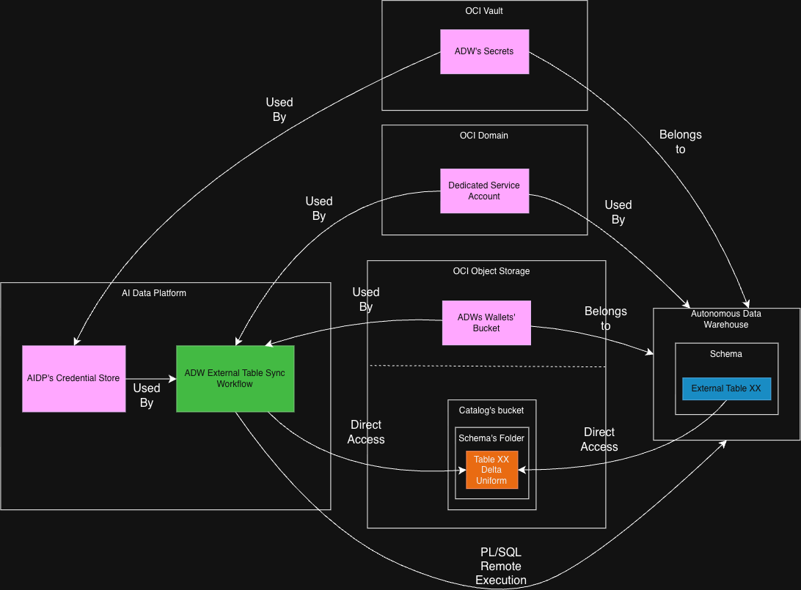
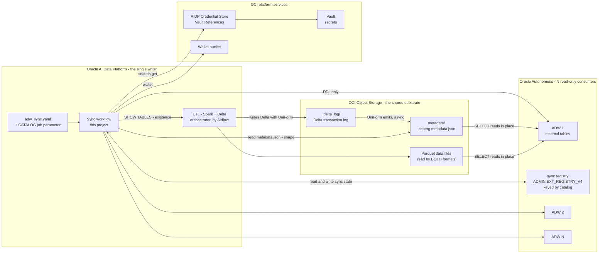
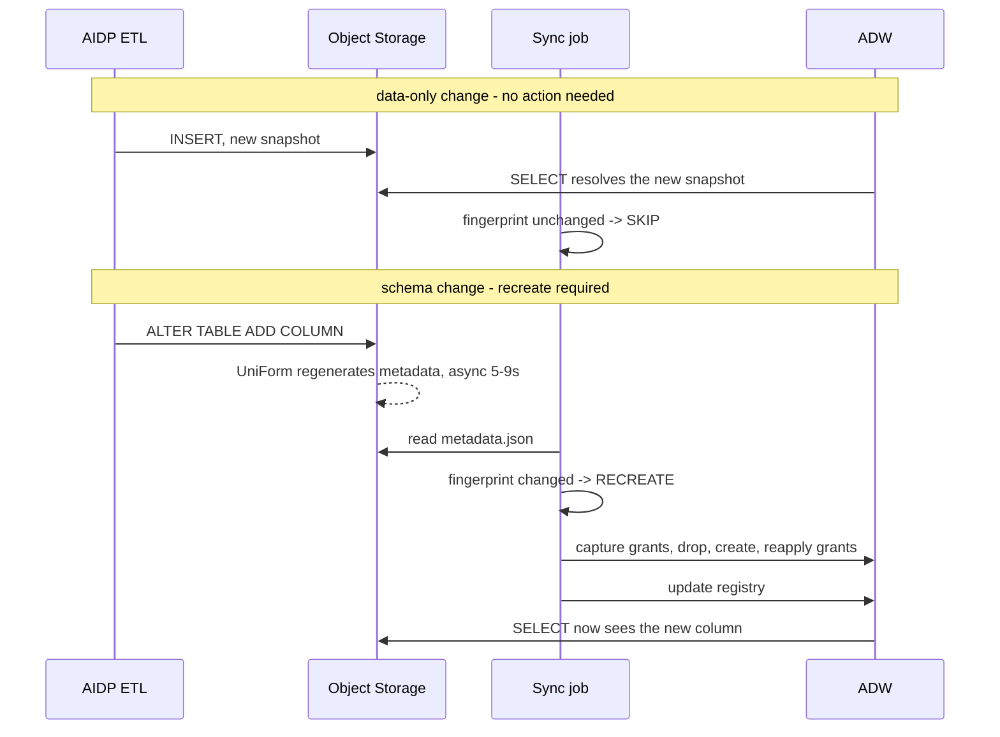

# Architecture: Iceberg external table sync, AIDP to Oracle Autonomous Database

A single-writer lakehouse in Oracle AI Data Platform, served **read-only** to N Autonomous
Data Warehouses as Iceberg external tables, with **no data copy** and **no catalog service in
the read path**.

This document is the design record: what it solves, how it works, and what was measured.

---

## 1. The problem

An enterprise lakehouse has one writer and many consumers. The consumers want SQL, governance
and the tooling they already own - which for many organisations means Oracle Database. The
straightforward answers all cost something:

| Approach | Cost |
|---|---|
| Copy data into each ADW | N copies, N pipelines, N points of staleness |
| Federated query per consumer | latency and load on the source, no local governance |
| Central Iceberg REST catalog | a service in the read path: to scale, secure and keep available |

There is a fourth option: let ADW read the lakehouse files **in place**. Oracle Autonomous
supports this natively for Apache Iceberg, and Delta Lake can emit Iceberg metadata alongside
its own through **UniForm**. No copy, no catalog service, no second writer.

That option has exactly one hard problem, and solving it is what this project is about.

### The hard problem: schema drift

An Iceberg external table in ADW has its **column list fixed at creation time**. Data changes
flow through on their own - ADW picks up new snapshots from the Iceberg metadata. Schema changes
do not:

- add a column: the external table keeps serving the old shape, silently;
- drop or rename a column: reads may fail outright.

Detecting that by hand, across hundreds of schemas and thousands of tables, on N warehouses, is
not an operational plan. It needs to be computed.

---

## 2. Solution in one diagram



Component and deployment view. Five boundaries matter:

| Boundary | Holds | Role |
|---|---|---|
| **AI Data Platform** | Credential Store, the sync workflow | the single writer, and the only thing that issues DDL |
| **OCI Object Storage** | the catalog bucket, plus a separate wallet bucket | the shared substrate; one copy of the data |
| **OCI Vault** | one secret per value | the only place a password exists at rest |
| **OCI Domain** | the dedicated service account | one identity, used by both the workflow and every ADW |
| **Autonomous Data Warehouse** | schema, external tables, sync registry | N read-only consumers |

Reading the edges:

| Label | Meaning |
|---|---|
| `Used By` | a runtime dependency: the target consumes this component |
| `Belongs to` | ownership, established at provisioning time - the wallet and the secrets exist *for* that ADW, but the ADW never reads them |
| `Direct Access` | reads straight from Object Storage, with no intermediary |
| `PL/SQL Remote Execution` | the workflow issuing `DBMS_CLOUD` calls and DDL over a database connection |

Two of those edges deserve a closer look, because the diagram necessarily flattens them.

**The two `Direct Access` arrows are not symmetric.** The workflow reads **metadata only** - the
Iceberg `metadata.json` - and never opens a data file; that is exactly why discovery is
O(schemas) and finishes in seconds. The ADW reads **metadata and the Parquet data files**, at
query time. No row of data ever passes through the AI Data Platform on the read path.

**`PL/SQL Remote Execution` carries DDL only.** The workflow creates users, grants, credentials
and external tables. It never moves data into an ADW. The single exception to "AIDP ETL is the
only writer to the lakehouse" is the optional `force_snapshot` flag, which lands one dummy row on
a source table and deletes it - and it is off by default.

The single service account is the detail worth noticing: the **same** API key that the workflow
uses to read Object Storage during discovery is the one each ADW uses, through
`DBMS_CLOUD.CREATE_CREDENTIAL`, to read Parquet at query time. One thing to grant, rotate and
audit.

The `.drawio.png` embeds its own source, so it can be reopened and edited directly in
[draw.io](https://app.diagrams.net).

### The same picture, with the flows labelled



**One writer, one copy of the data, N readers.** The notebook writes only DDL to the ADWs; it
never moves a row. Consumer queries read Parquet straight from Object Storage.

---

## 3. End-to-end flow

Enough detail to modify the code. Each box maps to a cell or a function.

```mermaid
flowchart TD
    START([Job starts<br/>parameter: CATALOG]) --> FIND

    subgraph C1["Cell 1 - Configuration"]
        FIND["Locate adw_sync.yaml<br/>CONFIG_PATH, cwd, next to notebook,<br/>or distinctive name"]
        FIND --> YAML["Load YAML<br/>region, prefixes, flags, parallelism"]
        YAML --> DERIVE["Derive SCHEMA_PREFIX = catalog_<br/>and CRED_NAME = OCI_CRED_CATALOG"]
        DERIVE --> SEC["Read secrets from Vault<br/>4 for the API key + 4 per ADW"]
        SEC --> FLEET["Build ADWS list"]
    end

    FLEET --> W

    subgraph C3["Cell 3 - Wallets"]
        W["Extract wallets to a per-run temp dir<br/>source marker prevents stale reuse"]
        W --> PING["One connection per ADW<br/>fail fast on creds, network, policy"]
    end

    PING --> D1

    subgraph C4["Cell 4 - Discovery: builds PLAN"]
        D1["SHOW NAMESPACES<br/>1 call for the catalog"]
        D1 --> D2["One DESCRIBE bootstrap<br/>learn bucket, root, schema-dir pattern"]
        D2 --> D3["Per schema: SHOW TABLES + SHOW VIEWS<br/>catalog is the authority on existence"]
        D3 --> D4["Flat list of the schema prefix<br/>OCI SDK, LIST_PAGE objects per request"]
        D4 --> D5["Pick highest vN.metadata.json per table<br/>no version-hint read needed"]
        D5 --> D6["Parallel GET of metadata.json<br/>READ_WORKERS threads"]
        D6 --> D7["Per table compute:<br/>fingerprint, ncols, partitioned,<br/>snapshot present, ALIGNED"]
        D7 --> D8{"metadata<br/>readable?"}
        D8 -->|no| PROT["PLAN_PROTECTED<br/>shielded from DROP this run"]
        D8 -->|yes| PLAN["PLAN entry:<br/>warehouse + table_path + fp"]
    end

    PLAN --> E1
    PROT --> E1

    subgraph C5["Cell 5 - Engine, per ADW"]
        E1["Read registry<br/>WHERE catalog_name = this catalog"]
        E1 --> E2{"cross-catalog<br/>collision?"}
        E2 -->|yes| ABORT([Abort this ADW<br/>other ADWs continue])
        E2 -->|no| E3["Diff fingerprints"]
        E3 --> DEC{"per table"}
        DEC -->|"absent in registry"| CR["CREATE"]
        DEC -->|"fp differs"| RC["RECREATE"]
        DEC -->|"fp matches"| SK["SKIP - no statement runs"]
        DEC -->|"in registry, not in source"| DR["DROP"]
    end

    CR --> FS
    RC --> FS
    DR --> AP

    FS{"force_snapshot<br/>and misaligned?"} -->|yes| FSW["Dummy INSERT + DELETE on Delta<br/>then poll metadata until aligned<br/>UniForm conversion is async, 5-9s"]
    FS -->|no| AP
    FSW --> AP

    subgraph C7["Cell 7 - Apply"]
        AP["Per schema: ALTER USER + grants + ACL"]
        AP --> AP2["Create DBMS_CLOUD credential<br/>once per schema, before parallelism"]
        AP2 --> AP3["Capture grants BEFORE drop"]
        AP3 --> AP4["DROP + CREATE_EXTERNAL_TABLE<br/>window measured at ~0.8s"]
        AP4 --> AP5["Reapply grants"]
        AP5 --> AP6["Update registry<br/>only what actually succeeded"]
    end

    AP6 --> RT{"failures and<br/>retry_failed?"}
    RT -->|yes| RETRY["One retry, then write registry"]
    RT -->|no| DONE
    RETRY --> DONE([Summary per ADW<br/>cleanup wallets<br/>raise if any ADW failed])
```



### Why the authority is split

The **catalog** decides what exists; **Object Storage** decides what shape it has.

An orphan folder left in storage by a failed job never enters the plan, because `SHOW TABLES`
does not list it. And the shape never depends on a Spark call per table, because the Iceberg
`metadata.json` already holds everything needed: the current schema, the snapshot, the
partition spec.

That split is what makes discovery O(schemas) instead of O(tables).

> **Caveat — partitioned Iceberg tables.** Oracle's Autonomous Database documentation lists
> *partitioned* Iceberg tables under the restrictions for `DBMS_CLOUD.CREATE_EXTERNAL_TABLE`.
> This sample syncs them anyway because AIDP Delta UniForm materializes the data files so ADW
> reads them as a flat external table, but partition **pruning** is not pushed down and behavior
> can change with ADB versions. Validate partitioned sources against your target ADB release
> before relying on them in production.

---

## 4. The incremental engine

### Fingerprint

For each table, discovery reads the Iceberg `metadata.json`, selects the schema whose
`schema-id` equals `current-schema-id`, and hashes the canonical form:

```
sha256( "name:type_json:required" joined by ";" )
```

Type is serialised with sorted keys so nested structs hash deterministically. `required` is
Iceberg's nullability. The result is a 64-character hex string.

**What this fingerprint deliberately ignores:** row counts, snapshots, file layout, statistics.
Those change on every ETL run and must **not** trigger a recreate - ADW resolves new snapshots
by itself.

### Registry

One table per ADW, created on demand:

```sql
CREATE TABLE ADMIN.EXT_REGISTRY_V4 (
  catalog_name VARCHAR2(128),
  owner        VARCHAR2(128),
  table_name   VARCHAR2(128),
  schema_fp    VARCHAR2(64),
  synced_at    TIMESTAMP,
  CONSTRAINT ext_registry_v4_pk PRIMARY KEY (catalog_name, owner, table_name)
) NOPARALLEL
```

`catalog_name` in the key is not decoration. Without it, running the notebook for a second
catalog against the same ADW makes every table of the first catalog look like a deletion
candidate. That was an actual bug: a second catalog computed `drop=4748`.

`NOPARALLEL` plus `ALTER SESSION DISABLE PARALLEL DML` avoids `ORA-12838`, since ADW enables
parallel DML by default and the registry MERGE is followed by reads of the same object.

### Decision table

| Registry state | Action | Statements executed |
|---|---|---|
| absent | CREATE | drop-if-exists, `CREATE_EXTERNAL_TABLE`, reapply grants |
| fingerprint differs | RECREATE | capture grants, drop, create, reapply grants |
| fingerprint matches | **SKIP** | none |
| in registry, absent from source | DROP | drop table and view |

**SKIP is the common case in steady state and costs zero DDL** (only the per-run registry read and session setup). That is what makes the
run time proportional to *change*, not to fleet size.

### Idempotency

Running twice in a row produces `create=0 recreate=0 drop=0` on the second run. Interrupting
mid-run is safe: the registry is written **after** the work, and only for the items that
actually succeeded, so an interrupted run leaves those tables looking like CREATE next time -
which is correct, and re-running converges.

---

## 5. Component inventory

### AIDP side

| Item | What for |
|---|---|
| Delta Lake with **UniForm** | writes Delta and emits Iceberg metadata for the same Parquet files |
| `delta.columnMapping.mode = name` | required by IcebergCompatV2 |
| `delta.enableIcebergCompatV2 = true` | the compatibility level ADW reads |
| `delta.universalFormat.enabledFormats = iceberg` | turns on Iceberg metadata generation |
| `delta.enableDeletionVectors = false` | belt and braces; IcebergCompatV2 already forbids active deletion vectors |
| Spark SQL | `SHOW NAMESPACES`, `SHOW TABLES`, `SHOW VIEWS`, `DESCRIBE EXTENDED` |
| `DESCRIBE EXTENDED` | the only way to get a table's physical location here - `DESCRIBE DETAIL` fails on these tables |
| Notebook job parameters | `oidlUtils.parameters.getParameter` |
| AIDP Credential Store | `aidputils.secrets.get`, Vault Reference type |
| Volume, optional | alternative location for wallet files |
| `oracledb` | Python driver, thin mode |
| `oci` Python SDK | Object Storage listing and reads |
| `pyyaml` | configuration |

`REORG TABLE ... APPLY (UPGRADE UNIFORM(ICEBERG_COMPAT_VERSION=2))` regenerates Iceberg
metadata when needed. Databricks' `MSCK REPAIR TABLE ... SYNC METADATA` does **not** exist in
open-source Spark and is not used.

### ADW side

| Item | What for |
|---|---|
| `DBMS_CLOUD.CREATE_EXTERNAL_TABLE` | creates the read-only Iceberg external table |
| `iceberg_catalog_type = hadoop` | file-based resolution, no catalog service |
| `iceberg_warehouse` + `iceberg_table_path` | coordinates derived from the physical path |
| `DBMS_CLOUD.CREATE_CREDENTIAL` | native OCI API key; resource principal is NOT supported for Iceberg |
| `DBMS_CLOUD.DROP_CREDENTIAL` | acts on the session user only |
| `DBMS_NETWORK_ACL_ADMIN.APPEND_HOST_ACE` | lets the schema reach Object Storage over HTTPS |
| `DATA_PUMP_DIR` | `GRANT READ, WRITE` required for **both creating and reading** an Iceberg external table |
| `ALTER SESSION DISABLE PARALLEL DML` | avoids `ORA-12838` around the registry MERGE |
| `user_tab_privs` | grant capture and replay across a recreate |
| `all_users`, `all_objects` | existence checks and teardown reporting |
| mTLS wallet, or TLS without wallet | connectivity |

Grants each schema user receives, direct rather than through a role, because roles are disabled
inside definer's-rights procedures:

```sql
GRANT CREATE SESSION, CREATE TABLE, CREATE VIEW TO <schema>;
GRANT EXECUTE ON DBMS_CLOUD TO <schema>;
GRANT READ, WRITE ON DIRECTORY DATA_PUMP_DIR TO <schema>;
ALTER USER <schema> QUOTA UNLIMITED ON DATA;
```

### OCI side

| Item | What for |
|---|---|
| Object Storage | the lakehouse itself, plus the wallet bucket |
| Vault + master encryption key | one secret per value; 25 KB base64 limit |
| AIDP Credential Store | Vault References; one credential points at one secret OCID |
| IAM service account with API key | the single identity that reads Object Storage, from both the notebook and every ADW |

### The service account

One IAM user, one API key, used by two consumers:

1. the notebook, to list and read Object Storage during discovery;
2. every ADW, through `DBMS_CLOUD.CREATE_CREDENTIAL`, to read Parquet and Iceberg metadata at
   query time.

Reusing one identity is deliberate: one thing to grant, rotate and audit. Its four fields live
in the Vault as four separate secrets.

### Policies

Reading secrets - the principal is the **AIDP service**:

```
allow any-user to use secrets         in compartment id <CMP> where all { request.principal.type = 'aidataplatform' }
allow any-user to read secret-bundles in compartment id <CMP> where all { request.principal.type = 'aidataplatform' }
```

Reading the wallet bucket - the principal is the **service account user**, a different subject:

```
allow group <SERVICE_ACCOUNT_GROUP> to read objects in compartment id <CMP> where target.bucket.name = 'aidp-adw-wallets'
```

Three IAM traps, all encountered in practice:

1. `secret` singular is **not** a valid resource-type and yields `Invalid parameter`. The valid
   ones are plural: `secrets`, `secret-bundles`, `secret-versions`, `secret-family`. The
   statement the AIDP console itself suggests is wrong here.
2. `in tenancy` is only valid in a policy created in the **root** compartment.
3. The AIDP console also suggests a condition on
   `target.resource.tag.orcl-aidp.governingAidpId`. **AIDP does not apply that system tag to
   referenced secrets** - verified after registering a Vault Reference. The predicate can never
   match, so the read fails. Consequence worth raising with a security team: today the grant can
   only be scoped by compartment, so every AIDP instance in that compartment can read the
   secrets.

---

## 6. Read-only by construction

- `DBMS_CLOUD.CREATE_EXTERNAL_TABLE` produces a **read-only** object. There is no write path
  from ADW into the lakehouse.
- The notebook issues **DDL only** on the ADW side. The only write to the lakehouse is the
  optional `force_snapshot`, and it goes through Spark on the AIDP side, writing one dummy row
  and deleting it.
- Consumers see ordinary Oracle tables and can be governed with ordinary Oracle tools: grants,
  VPD, Data Redaction, and views if `flags.create_views` is enabled.

Concurrency was measured rather than assumed. During a `DROP` plus `CREATE` of an external
table:

- the drop took 0.03 to 0.2s and never blocked; no `ORA-00054`;
- the total window was about 0.8s, and `ORA-00942` appeared only inside it;
- `object_id` changed, proving a real drop and create rather than a no-op;
- two long scans of 385s and 321s returned the **identical 2,987,970 rows** across a rename, a
  drop, a recreate, a force snapshot and a second recreate.

A reader already inside a query is unaffected. A query that *starts* inside the sub-second
window can fail with `ORA-00942`, which argues for scheduling syncs outside peak read windows.

---

## 7. Scalability

### What was measured

| Dimension | Result |
|---|---|
| Tables provisioned in one run | **4,777 tables x 2 ADWs**, 10 schemas |
| Discovery, flat listing | 5,731 objects in **6 requests, 0.3s** |
| Discovery, metadata read plus fingerprint | 476 tables in 2.7s = **174 tables/s** |
| Discovery, total per schema | **3.0s** |
| Discovery projection for 4,777 tables | roughly **30s** |
| Largest single table read through an external table | **30M rows**, 385s scan |
| External table drop plus recreate window | **~0.8s** |
| UniForm Iceberg conversion latency after DDL | **5 to 9s**, asynchronous |

### What the previous approaches cost

| Approach | Throughput | Why |
|---|---|---|
| Spark `recursiveFileLookup` | unusable | lists every file in the tree |
| Driver-side glob | very slow | resolves directory by directory |
| `listStatus` over py4j | **8 tables/s** | roughly 20 JVM bridge round-trips per table |
| Per-table `DESCRIBE EXTENDED` | **0.7 tables/s** cold, ~2h for the fleet | one metastore call per table |
| **OCI SDK flat listing** | **174 tables/s** | one request returns 1,000 objects |

That is a 20x improvement over the next best option, and it came from changing *who* enumerates
the metadata, not from tuning threads.

### How each axis scales

| Axis | Behaviour |
|---|---|
| Number of tables | discovery is O(schemas) for listing plus O(tables) for cheap parallel GETs. Apply is O(changed tables), not O(total) |
| Number of schemas | linear, parallelised by `discovery_workers` |
| Number of ADWs | linear, parallelised up to `adw_workers_cap`. Fleet size comes from the config; concurrency stays a separate cap |
| Steady state | dominated by discovery. With no schema change, apply executes **zero** statements |
| Concurrent connections | `min(fleet, adw_workers_cap) x workers`. With the defaults, 4 x 8 = 32 |

### Where the real ceiling is

**Not on the ADW side.** The binding constraint measured in this project was *creating* UniForm
tables in AIDP: seeding 6,000 tiny tables OOM'd the Spark driver at 24 concurrent threads and
made little progress at 8, because per-table cost is dominated by remote metastore calls plus
asynchronous UniForm conversion. Reading and provisioning at that scale was comparatively cheap.

If ADW-side throughput ever needs measuring in isolation, point many external tables at a
handful of real Iceberg paths rather than seeding thousands of Delta tables.

### Multiple catalogs against the same fleet

The intended deployment is one job per catalog, several pointing at the same ADWs. **Run them in
sequence, not in parallel.** This is an operational recommendation, not a code lock, for two
reasons:

- **Sessions.** Each job opens up to `workers` connections per ADW. With K concurrent catalogs
  that is `workers x K` on one ADW - with 8 and 10 catalogs, 80 sessions.
- **Schema password.** The provisioner must connect **as the schema**, because
  `DBMS_CLOUD.CREATE_CREDENTIAL` stores the credential under the session user. Oracle keeps only
  the password hash, so the only way to know a password is to set one. Two jobs with work in the
  same schema rotate the password under each other and new connections fail with `ORA-01017`,
  intermittently. Proxy authentication - `ALTER USER <schema> GRANT CONNECT THROUGH ADMIN` -
  removes this class entirely and is the recommended next step. Not implemented.

Two protections exist in code for the case where they run concurrently anyway:

1. **The schema prefix is fixed at `<catalog>_` and is not configurable.** Without it, two
   catalogs holding a same-named schema and table write to the same ADW object; since the
   registry is per catalog, both would see their own fingerprint match and report SKIP - the
   table serving one catalog's data while both claim to be in sync. Silent wrong data.
2. **Cross-catalog collision guard.** Before applying, the job checks whether any object it
   would create already belongs to another `catalog_name` and aborts with a named error. The
   failure is per ADW; the others continue and the job still exits non-zero.

---

## 8. Schema drift, end to end



### Snapshot versus current schema

Iceberg keeps a `current-schema-id` on the table and a `schema-id` on **every snapshot**. After a
**metadata-only** change - adding, dropping or renaming a column under column mapping - the
current schema advances, but the tip snapshot still references the schema that was current when
it was written. No new data file is produced, so no new snapshot is either.

A consumer that resolves the table shape through `current-schema-id` sees the new columns
immediately. A consumer that resolves it **through the snapshot** keeps seeing the previous set,
even though the external table was recreated from correct coordinates.

`aligned = (tip_snapshot.schema-id == current-schema-id)` captures the condition exactly.
Discovery computes it for free, because the `metadata.json` is already in memory, and reports the
misaligned tables so the state is visible rather than silent. This matters because the
`CREATE` succeeds either way - only the shape a snapshot-resolving consumer observes differs.

| Resolution | Effect |
|---|---|
| Any real data commit on the table | realigns the two; the next normal ETL write is enough |
| `flags.force_snapshot` | lands a dummy row and deletes it, **only** on misaligned tables, then polls until the metadata regenerates |
| `OPTIMIZE` | not recommended: can take hours and may not produce a new snapshot |

**`force_snapshot` is off by default and should stay off unless the new shape must be visible
immediately.** It writes to the source lakehouse, and every affected table then requires waiting
for the asynchronous Iceberg metadata regeneration - measured at 5 to 9 seconds per table. With
many misaligned tables that wait dominates the run, turning a sync of seconds into one of
minutes. Treat it as a deliberate, per-run choice.

## 9. Design decisions worth keeping

| Decision | Reason |
|---|---|
| Hadoop catalog, not a REST catalog | no service in the read path; a stated requirement |
| Fingerprint from Iceberg metadata, not from Spark | no per-table Spark call; discovery drops from ~2h to ~30s |
| Registry keyed by catalog | lets catalogs share an ADW without cross-deletion |
| Schema prefix fixed, not configurable | the protection cannot be switched off by accident |
| One secret holds one value, never JSON | the masking layer redacts the exact returned string; a value parsed out of JSON would leak into notebook output |
| Short, common values stay OUT of the Vault | with `ADMIN` in the Vault, every `SELECT user`, error message and `all_users` listing prints as `[REDACTED]` |
| Wallets in a bucket, not a Volume | provisioning becomes a CLI or Terraform call; several AIDP instances share one fleet |
| Discovery shields unreadable tables from DROP | a transient read failure must never delete a healthy external table |
| Registry written after the work, only for successes | an interrupted run converges instead of lying |
| Grants captured before the drop | `DROP` loses object grants; a recreate would silently revoke every consumer |

---

## 10. Test evidence

What was actually exercised, and what was not.

| Test | Result |
|---|---|
| 4,777 tables x 2 ADWs, 10 schemas | passed |
| Four catalog and schema layout combinations | passed - default catalog and `<id>.cat` / `<schema>.db` |
| Idempotency, second run | `create=0 recreate=0 drop=0` |
| Cross-catalog isolation | reproduced the `drop=4748` bug, then fixed and verified |
| Concurrent reader across drop and recreate | identical 2,987,970 rows across two long scans |
| 30M-row table through an external table | passed, 385s |
| Partitioned versus clustered UniForm | both read correctly; metadata inspected |
| `RENAME COLUMN` and `DROP COLUMN` drift | `aligned` matched the observed consumer behaviour three times out of three |
| Async UniForm conversion | measured at 5 to 9s; recreating earlier yields the old columns |
| Vault secret rotation | new version picked up in the same session, no restart |
| Config discovery in a scheduled workflow | resolved with three decoy `config.yaml` files present |
| Wallet from an Object Storage bucket | passed |
| **Not tested:** parallel reader on the `_high` service | - |
| **Not tested:** `PRESERVE_GRANTS` main path with real grants | - |
| **Not tested:** snapshot auto-resolve without recreate | - |
| **Not tested:** more than 2 ADWs in one fleet | - |
| **Not tested:** concurrent catalogs against one ADW | deliberately: the recommendation is sequential |

The raw experiment notebooks behind the concurrency and drift rows are not part of this sample.
They were exploratory scaffolding, wired to one specific environment and not reproducible
elsewhere without rewriting them, so the table above is what survives of that work. The
conditions each row exercised are described in sections 7 and 8, which is enough to rebuild any
of these tests against your own fleet.

---

## 11. References

**Delta UniForm**
- [Delta Lake Universal Format - UniForm](https://docs.delta.io/latest/delta-uniform.html)
- [Delta protocol - IcebergCompatV2 writer requirements](https://github.com/delta-io/delta/blob/master/PROTOCOL.md)
- [Delta Lake column mapping](https://docs.delta.io/latest/delta-column-mapping.html)

**Oracle Autonomous, external data**
- [Query external data with Apache Iceberg](https://docs.oracle.com/en-us/iaas/autonomous-database-serverless/doc/query-external-data-apache-iceberg.html)
- [DBMS_CLOUD.CREATE_EXTERNAL_TABLE](https://docs.oracle.com/en-us/iaas/autonomous-database-serverless/doc/dbms-cloud-subprograms.html)
- [DBMS_CLOUD credential management](https://docs.oracle.com/en-us/iaas/autonomous-database-serverless/doc/dbms-cloud-subprograms.html)
- [Store credentials in an OCI Vault secret](https://blogs.oracle.com/autonomous-ai-database/oci-vault-secret-dbms-cloud-autonomous-database)

**Connectivity**
- [Connect Python applications without a wallet - TLS](https://docs.oracle.com/en/cloud/paas/autonomous-database/serverless/adbsb/connecting-python-tls.html)
- [Connect Python applications with a wallet - mTLS](https://docs.oracle.com/en/cloud/paas/autonomous-database/serverless/adbsb/connecting-python-mtls.html)
- [python-oracledb authentication options](https://python-oracledb.readthedocs.io/en/stable/user_guide/authentication_methods.html)

**Apache Iceberg**
- [Iceberg table specification](https://iceberg.apache.org/spec/)
- [Iceberg Hadoop catalog](https://iceberg.apache.org/docs/latest/configuration/)

**OCI platform**
- [Vault - managing secrets](https://docs.oracle.com/en-us/iaas/Content/secret-management/Concepts/manage-secrets.htm)
- [Vault and KMS policy reference](https://docs.oracle.com/en-us/iaas/Content/Identity/Reference/keypolicyreference.htm)
- [Object Storage - list objects](https://docs.oracle.com/en-us/iaas/api/#/en/objectstorage/latest/Object/ListObjects)

**AIDP**
- [Credential Store - Preview](https://docs.oracle.com/en/cloud/paas/ai-data-platform/aidug/credential-store.html)
- [Passing parameters in workflows](https://docs.oracle.com/en/cloud/paas/ai-data-platform/aidug/parameters1.html)
- [AIDP SDK and CLI](https://docs.oracle.com/en/cloud/paas/ai-data-platform/aiwap/sdkandcli.html)
- [aidataplatform-sdk on GitHub](https://github.com/oracle-samples/aidataplatform-sdk)
