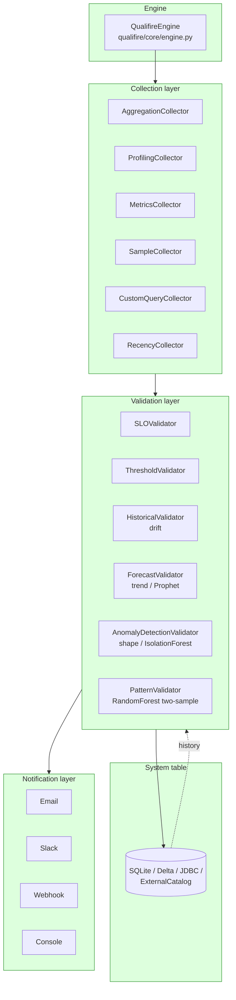
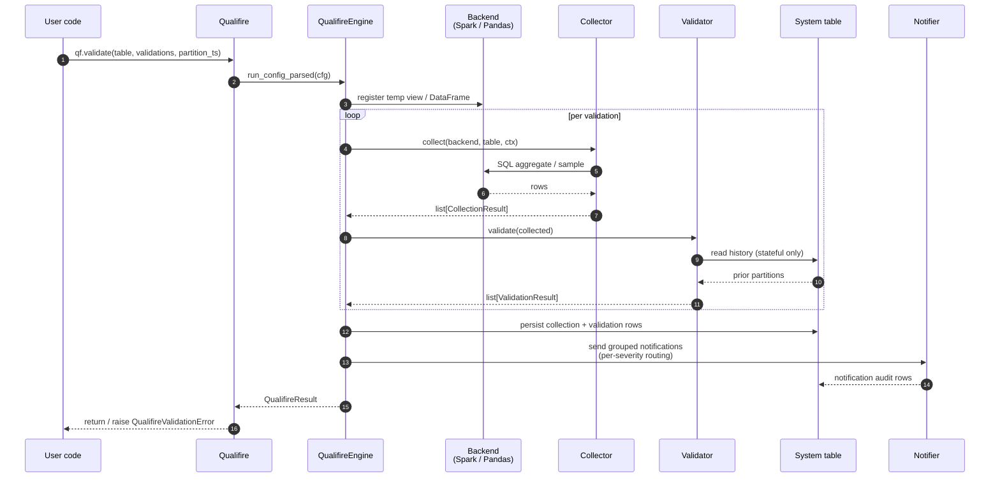
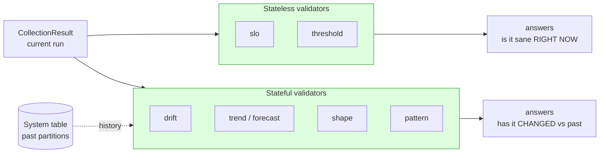

# Architecture

How qualifire works under the hood. Read this when you want a
mental model bigger than "I copied the YAML and it ran."

> **Scope of this document.** Six sections: the four-layer
> overview (§0), end-to-end value flow with a sequence view
> (§1), the WAP lifecycle (§2), the backfill driver loop
> (§2a), the stateless-vs-stateful read-pattern split (§2b),
> and a one-line pointer to remaining deferred backlog (§3).
> The comprehensive Pydantic-class reference is in
> `docs/configuration.md`; the per-feature "what changed" log
> is in `docs/CHANGELOG.md`.

## 0. The four layers at a glance

Qualifire is one library with four cooperating layers behind
the `Qualifire(...)` facade:



- **Collection** turns rows in the source table (or an
  in-memory DataFrame) into `CollectionResult` records — the
  numeric / sample inputs every validator consumes.
- **Validation** runs one or more `Validator`s over the
  collected records and emits `ValidationResult`s with a
  PASS / WARNING / ERROR severity.
- **System table** persists every collection, validation, and
  notification row keyed by `(dataset, metric, dimension,
  partition_ts)`. Stateful validators (drift / forecast /
  shape / pattern) read it back for prior partitions.
- **Notification** routes the validator output through email
  / Slack / webhook / console channels with per-severity
  routing, dedup, and grouping.

The rest of this document zooms into each layer. The next
section traces one value end-to-end; §2/§2a/§2b cover the
parts that need their own narrative.

## 1. How a value flows

A single `ThresholdValidationConfig` in YAML produces a
`ValidationResult` and (if it tripped a threshold) a
notification + a system-table row that the next run can read
back as history. The diagram below traces one run from YAML
through every layer.

```
                   ┌──────────────────────────────────┐
                   │  qf.yml (Pydantic-validated)     │
                   │  - dataset: orders               │
                   │  - threshold check on row_count  │
                   └─────────────┬────────────────────┘
                                 │
                                 ▼
                ┌────────────────────────────────────┐
                │  Qualifire.run_config_parsed(cfg)  │
                │  qualifire/api.py                  │
                │  - validates secrets               │
                │  - swaps storage if config         │
                │    differs from instance           │
                │  - sets ctx.skip_recollection /    │
                │    skip_revalidation /             │
                │    skip_renotification flags       │
                └─────────────┬──────────────────────┘
                              │
                              ▼
                ┌────────────────────────────────────┐
                │  QualifireEngine.run()             │
                │  qualifire/core/engine.py          │
                │  per-dataset loop:                 │
                └─────────────┬──────────────────────┘
                              │
                              ▼
   ┌──────────────────────────────────────────────────────────┐
   │  _run_dataset(ds_config)                                  │
   │  ┌──────────────────────────────────────────────────────┐│
   │  │  Phase 1 — collection                                ││
   │  │                                                      ││
   │  │  for val_config in ds.validations:                   ││
   │  │    _collect(ds_config, val_config)                   ││
   │  │      ├─ skip_recollection pre-pass                   ││
   │  │      │  (data-presence at partition;                 ││
   │  │      │   replays system-table rows)                  ││
   │  │      └─ collector.collect(backend, table, ctx)       ││
   │  │         e.g. AggregationCollector — emits            ││
   │  │         CollectionResult per (metric, dim)           ││
   │  └──────────────────────────────────────────────────────┘│
   │  ┌──────────────────────────────────────────────────────┐│
   │  │  Phase 2 — validation                                ││
   │  │                                                      ││
   │  │  for val_config in ds.validations:                   ││
   │  │    _validate(ds_config, val_config, collected)       ││
   │  │      ├─ skip_revalidation pre-pass                   ││
   │  │      │  (replays persisted ValidationResults)        ││
   │  │      └─ validator.validate(collected)                ││
   │  │         e.g. ThresholdValidator — emits              ││
   │  │         ValidationResult per (metric, dim)           ││
   │  └──────────────────────────────────────────────────────┘│
   └──────────────────────────────────────────────────────────┘
                              │
                              ▼
   ┌──────────────────────────────────────────────────────────┐
   │  After every dataset finishes (engine.py:475):            │
   │                                                           │
   │  1. snapshot = _prefetch_suppression_snapshot(result)     │
   │     (only when skip_renotification=True; otherwise {})    │
   │  2. outcome = _persist_data_rows(result)                  │
   │     → system-table writes for collection + validation +   │
   │       engine_warning rows                                 │
   │  3. if outcome != INFRA_FAILURE:                          │
   │       result.notifications =                              │
   │         _send_grouped_notifications(result, snapshot)     │
   │  4. _persist_notification_rows(result)                    │
   │     → system-table writes for notification audit rows     │
   └─────────────┬─────────────────────────────────────────────┘
                 │
                 ▼
   ┌──────────────────────────────────────────────────────────┐
   │  Storage backend                                          │
   │  qualifire/storage/{sqlite,delta,jdbc,external_catalog}.py│
   │                                                           │
   │  Single system table; rows distinguished by               │
   │  record_type: 'collection' | 'validation' | 'notification'│
   │                                                           │
   │  Reads dedup latest-per-natural-key via ROW_NUMBER OVER   │
   │  PARTITION BY (metric_name, dimension_value, partition_ts)│
   │  ORDER BY run_timestamp DESC, then post-dedup filter      │
   │  is_active = 'true' so a tombstone                        │
   │  hides an older live row at the same key.                 │
   └──────────────────────────────────────────────────────────┘
                 │
                 ▼
   ┌──────────────────────────────────────────────────────────┐
   │  Next run reads back — drift / forecast / pattern         │
   │  validators key history lookups on                        │
   │  (table_name, metric_name, partition_ts, dim) and the     │
   │  storage helpers' two-stage CTE.                          │
   └──────────────────────────────────────────────────────────┘
```

### Sequence view — one `qf.validate(...)` call

The ASCII trace above is the canonical view. The sequence
diagram below is the same flow rendered as actor interactions
— useful when reading `engine.py` for the first time.



The numbered steps line up with the ASCII trace: step 1
matches `qf.yml (Pydantic-validated)`, steps 4-8 are the
per-dataset collection + validation loop, steps 9-11 are the
post-dataset persistence + notification sequence at
`engine.py:475`.

### Storage read pattern — two-stage logic, per-backend shape

Every history / per-partition read uses the same two-stage
**logic** to handle soft-delete correctly:

1. **Rank** rows per natural key by recency
   (`run_timestamp DESC`, with `collected_at` /
   `validated_at` / `run_id` as tiebreakers depending on the
   call site).
2. **Filter** the top-ranked row by `is_active = 'true'`.

Order matters: a tombstone (`is_active='false'`) must WIN
the rank when it's the newest write, then be dropped by the
filter. If you reversed the order, an older live row could
shadow a newer tombstone — exactly the soft-delete bug this
contract prevents.

**The shape that implements this two-stage logic differs by
backend and call site.** Highlights:

- Point lookups (`read_collection_metric_at_partition` and
  the singular `read_validation_history`) use a **single
  ranked CTE** on SQLite / Delta / ExternalCatalog. JDBC
  uses a JDBC subquery + Spark window function instead
  (Spark-side ranking is portable across the JDBC dialects
  qualifire targets).
- Bulk reads (`read_validation_history_bulk` with `limit > 1`)
  on SQLite use **three CTEs** (`input_keys`,
  `per_partition`, `active_per_partition`); Delta and
  ExternalCatalog use a **temp view** for the input keys plus
  two ranking CTEs; JDBC pulls rows then ranks client-side
  in Python.

See the per-backend implementations in
`qualifire/storage/{sqlite,delta,external_catalog,jdbc}_storage.py`
for the exact SQL each path emits. The common contract is
"latest by recency, then filter by is_active" — the shape is
whatever each backend's dialect supports.

### Skip-* flag interactions

The three runtime skip-* flags compose freely; each gates a
different stage of the pipeline:

| Flag | Stage gated | Pre-pass calls |
|---|---|---|
| `skip_recollection` | collection | `read_collection_metric_at_partition` per `(metric, dim)` |
| `skip_revalidation` | validation  | `read_validations_at_partition` per validator |
| `skip_renotification` | notification | `read_validation_history_bulk` (snapshot) |

All default-False. Any subset can be enabled independently.
See `docs/CHANGELOG.md` Unreleased entries for the contract on
each.

## 2. WAP lifecycle

Write-Audit-Publish (WAP) lets a job validate proposed data
BEFORE it lands in the published table. The flow:

```
              ┌─────────────────────────────────────┐
              │ Qualifire.write_audit_publish(      │
              │   target_table='orders',            │
              │   df=new_orders_df,                 │
              │   validations=[...],                │
              │ )                                   │
              └──────────────┬──────────────────────┘
                             │
                             ▼
              ┌─────────────────────────────────────┐
              │ WRITE phase                         │
              │ qualifire/wap/                      │
              │                                     │
              │ Materialize df / sql to a staging   │
              │ table (qualifire-managed name).     │
              └──────────────┬──────────────────────┘
                             │
                             ▼
              ┌─────────────────────────────────────┐
              │ AUDIT phase                         │
              │                                     │
              │ Run all validations against the     │
              │ staging table — same engine path,   │
              │ same collectors, same validators.   │
              │ ValidationResults emit as usual.    │
              └──────────────┬──────────────────────┘
                             │
              ┌──────────────┴──────────────┐
              │                             │
              ▼                             ▼
   ┌─────────────────────┐        ┌─────────────────────┐
   │ PUBLISH phase       │        │ ROLLBACK phase      │
   │ (severity ≤ WARNING)│        │ (any ERROR)         │
   │                     │        │                     │
   │ Atomic move:        │        │ Drop staging table; │
   │ staging → target    │        │ raise QualifireValid│
   │ (overwrite or merge │        │ ationError with the │
   │ depending on        │        │ failing results.    │
   │ write_options)      │        │ target table is     │
   └─────────────────────┘        │ untouched.          │
                                  └─────────────────────┘
```

The audit rows persist whether the publish succeeds or rolls
back — operators see the run in the system table either way.
The `details_json` column tags rows with
`collected_via='wap-audit'` (or `'wap-publish'` post-promote)
so dashboards can distinguish staging-time validation from
promoted-table validation.

## 2a. Backfill loop

`qualifire backfill --partition START..END` (or
`Qualifire.backfill(...)` programmatically) re-runs collection
+ validation for a closed range of partition anchors and emits
a `BackfillReport` summarizing what changed per
`(dataset, metric, partition_ts)` tuple. The driver lives in
`qualifire/core/backfill.py:run_backfill`.

```
              ┌─────────────────────────────────────┐
              │ qualifire backfill --partition R    │
              │ Qualifire.backfill(...)             │
              └──────────────┬──────────────────────┘
                             │
                             ▼
              ┌─────────────────────────────────────┐
              │ run_backfill (backfill.py:197)      │
              │  1. _resolve_scopes(config, sel)    │
              │  2. expand_partition_ts(range)      │
              │  3. build _WorkUnit list, one per   │
              │     (scope, anchor); seq_idx fixes  │
              │     serial-mode order               │
              └──────────────┬──────────────────────┘
                             │
              ┌──────────────┴──────────────────┐
              │ parallelism == 1                │ parallelism > 1
              ▼                                 ▼
   ┌─────────────────────┐         ┌──────────────────────────┐
   │ serial loop         │         │ ThreadPoolExecutor       │
   │ _process_anchor per │         │ submits _process_anchor  │
   │ unit in order       │         │ per unit; notifiers={}   │
   │                     │         │ forced → suppression-    │
   │                     │         │ race-free;               │
   │                     │         │ BackfillReport.notifica- │
   │                     │         │ tions_suppressed=True    │
   └──────────┬──────────┘         └──────────────┬───────────┘
              │                                   │
              └────────────────┬──────────────────┘
                               │
                               ▼
   ┌──────────────────────────────────────────────────────────┐
   │  _process_anchor(unit)  (backfill.py:350)                 │
   │                                                           │
   │  Pass 1a — pre-engine reads (per metric):                 │
   │    _read_original_value(storage, table, m, anchor)        │
   │    _read_severity_before(storage, ds, m, vals, anchor)    │
   │    → _PreEngine cache. Failure here aborts the anchor —   │
   │      every metric reports errored, engine.run() SKIPPED.  │
   │                                                           │
   │  Pass 1b — bulk tombstone (only if soft_delete_prior):    │
   │    build_prior_tombstone_rows per metric →                │
   │    storage.write_results(all_rows) in ONE call.           │
   │    All-or-nothing: bulk-write failure aborts the anchor   │
   │    cleanly, no partial-tombstone state left behind.       │
   │                                                           │
   │  Engine-once:                                             │
   │    _run_anchor_once(...) (backfill.py:581) → engine.run() │
   │    invoked EXACTLY once per (scope, anchor). Skipped      │
   │    entirely when metric_names is empty (scope of only     │
   │    sample-based validators).                              │
   │                                                           │
   │  Pass 2 — post-engine diff build (per metric):            │
   │    _extract_metric_severity(result, m) →                  │
   │    (backfilled_value, severity_after) →                   │
   │    PartitionDiff(status=refreshed|unchanged|skipped|...). │
   │    Sample validators (Pattern / AnomalyDetection) get     │
   │    status="skipped" diffs appended at the end with        │
   │    skip_reason="no_historical_samples".                   │
   └──────────────────────────┬───────────────────────────────┘
                              │
                              ▼
   ┌──────────────────────────────────────────────────────────┐
   │  sort results by seq_idx → preserve serial-mode order    │
   │  even when ThreadPoolExecutor completed out of order.    │
   └──────────────────────────┬───────────────────────────────┘
                              │
                              ▼
   ┌──────────────────────────────────────────────────────────┐
   │  BackfillReport (qualifire/core/backfill_report.py)       │
   │    partitions: list[PartitionDiff]                        │
   │    refreshed / unchanged / skipped / errored: int         │
   │    notifications_suppressed: bool                         │
   └──────────────────────────────────────────────────────────┘
```

### Why tombstones write BEFORE the engine

Pass 1b runs before `_run_anchor_once`. That ordering is
deliberate: storage reads use the
"latest-by-recency-then-filter-active" contract from §1, so a
tombstone landed before the engine's forward write puts the
new row at the top of the rank — older live rows can't shadow
it. The all-or-nothing bulk write means if tombstones can't
land cleanly, the engine is skipped entirely; you never end
up with metric A tombstoned and metric B live in the same
anchor's pre-state.

### Why parallel mode forces `notifiers={}`

`_send_grouped_notifications` consults
`read_validation_history_bulk` to compute a per-run
suppression snapshot. Two anchor workers running concurrently
both read + write that history, so the snapshot they see is
non-deterministic. Forcing `notifiers={}` for the inner
engine call sidesteps the race; the report's
`notifications_suppressed=True` flag makes the trade-off
visible to operators (re-run serially when you need
notifications fired from a backfill).

### Pre-engine reads anchor on `partition_ts`

`_read_original_value` and `_read_severity_before` both key
on `unit.anchor`, not on the partition that happens to be
"current" in the operator's clock. Without that, severity
deltas after a backfill could compare a fresh value at
anchor T against the most recent severity at T+30 — see
the `backfill-severity-before-broken-readback` shipped
feature for the previous bug.

### Why sample validators surface as `"skipped"`

Pattern and AnomalyDetection persist a `sample` row with
`metric_value=NULL` (the data lives in `details_json`).
There's no scalar to diff, so the per-metric Pass 2 loop
can't produce a meaningful `refreshed`/`unchanged` verdict.
`_process_anchor` appends `status="skipped"` diffs
(`skip_reason="no_historical_samples"`) for each
sample-based validator on TWO separate exit paths — once
in the engine-failure `except` block before its early
return, and once at the end of the function after the
happy-path Pass 2 loop. Either way, operators always see
each sample-validator name in the report.

For the operator-facing usage of these mechanics, see
[`docs/backfill_and_soft_delete.md`](backfill_and_soft_delete.md).
For per-PR contract changes (parallelism, max-partitions,
severity-before readback), see [`docs/CHANGELOG.md`](CHANGELOG.md).

## 2b. Stateless vs stateful validators

Qualifire's six validators split cleanly along one axis: do
they read the system table, or do they answer from the
current run alone?



| | Stateless | Stateful |
|---|---|---|
| **Validators** | `slo`, `threshold` | `drift`, `trend` (forecast), `shape`, `pattern` |
| **Reads system table?** | No | Yes — `read_metric_history_by_partition` (drift / trend) or sample sentinel + slice read (shape / pattern) |
| **Cold-start behaviour** | Always answerable | First-N runs return cold-start results (`details.cold_start = True`); the operator picks PASS / WARNING / ERROR via `on_missing_history` |
| **`partition_ts` required?** | No | Yes — both `DatasetConfig.partition_ts` and the rule's `step` must be set, or the validator surfaces a structured ERROR. `run_timestamp` is never used as a fallback because it's wall-clock, not logical time |
| **Replayable via `qf.backfill(...)`?** | Idempotent by definition | Yes — backfill writes at the historical `partition_ts` so a stateful validator's lookback finds the seeded row on the next forward run |

The split is not a quality judgement — it is a read-pattern
statement. Stateless validators run anywhere, including on a
brand-new table. Stateful validators need a warm-up period
during which they emit cold-start results; the operator decides
whether cold-start is PASS, WARNING, or ERROR via
`on_missing_history`.

The split also drives the `qf.backfill(...)` API (§2a):
stateful validators can be retroactively warmed by inserting
historical rows at the correct `partition_ts`, with no
source-side rewrite needed.

## 3. What's NOT in this doc yet

Comprehensive coverage complete. Future features update
`docs/architecture.md` / `docs/configuration.md` as part
of their own implementation ACs.
