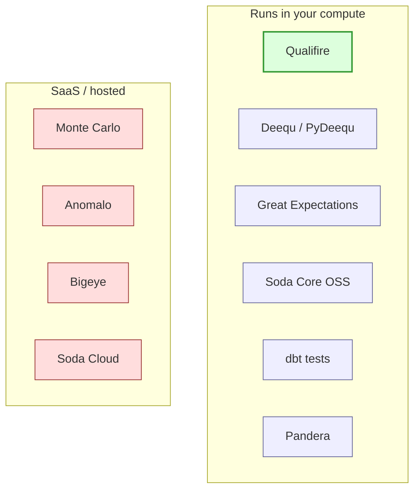

# How Qualifire compares to other DQ libraries

The DQ landscape is well-populated; this page exists so an
evaluator can decide whether Qualifire fits before reading the
rest of the docs. It is not a tier list. Each tool listed here
solves a real problem; the question is whether the problem you
have is the one Qualifire is built for.

The short version: Qualifire is the AIDP-native layer that
absorbs the parts of each tool that fit the platform's
identity model, storage, and notification, without dragging in
the parts that don't.

## Landscape

The split that matters most for AIDP-internal use is the top
one: tools that run inside your Spark cluster vs. tools that
query your warehouse from a vendor-hosted control plane. The
two have different trust boundaries, different cost models,
and different incident-response postures.

## Side-by-side: what each tool optimises for

| Library | Runtime | History store | ML / multivariate | WAP / staging | Notifications | AIDP fit |
|---|---|---|---|---|---|---|
| **Qualifire** | Spark + Pandas (driver-only) | First-class system table; 4 backends (`external_catalog`, `delta`, `sqlite`, `jdbc`) | Isolation Forest (shape) + RandomForest two-sample (pattern), both with SHAP; Prophet (forecast / trend) | First-class `Qualifire.write_audit_publish(...)` | Email / Slack / webhook / console; severity routing; dedup; grouping; dual-layer redaction | Native: `aidputils` secrets, `{{ job.* }}` Jinja, external-catalog default backend |
| **Great Expectations** | Pandas / Spark / SQL adapters | Validation-results store (JSON files or optional DB) | None natively; expectations are predicates | None — runs after writes | Email / Slack via Actions; no built-in dedup | Possible but multi-concept (Datasource, Action runner, Checkpoint, Data Docs) |
| **Deequ / PyDeequ** | Spark only | `MetricsRepository` abstraction (file + JDBC) | Anomaly detection on metric series (mean / stddev / online); no per-row Isolation Forest | None | None built-in | Runs on Spark; Scala-first, Python API trails |
| **Soda Core (OSS)** | SQL warehouse-side mostly; some Spark | Scan results (Soda Cloud or self-managed file) | Basic anomaly detection on metric values | None | Email / Slack / webhook | YAML-driven, lighter on multivariate |
| **dbt tests / dbt-expectations** | Whatever runs `dbt` | dbt artifacts; no native time series | None | dbt's pre-hook surface; not WAP-shaped | dbt Cloud or external | Possible if AIDP runs `dbt`; not a DQ-first tool |
| **Pandera** | Pandas / Polars; some PySpark | None — schema-as-code | None | None | None built-in | Lightweight; in-pipeline assertions, not platform DQ |
| **Monte Carlo / Bigeye / Anomalo** | Vendor-hosted control plane, queries your warehouse | Vendor-managed | ML anomaly detection is the core product | None | Rich, vendor-managed | Vendor-hosted; separate identity / cost line |

The table reads left-to-right as a feature comparison, not as
a score. A team running dbt warehouse-first will find dbt
tests + dbt-expectations enough for schema-grade checks; a
team needing multivariate anomaly detection on Spark
DataFrames will find Pandera the wrong shape; a team that
has already paid for Monte Carlo doesn't gain anything
swapping it for Qualifire on the same data.

## Per-library notes

**Great Expectations** has the largest catalogue of expectations
(>50) and the most thorough documentation. The runtime
introduces several concepts (Datasource, Checkpoint, Action,
Data Docs) that smaller teams find heavy. Qualifire ships one
YAML surface + one Python entry point and relies on
[`docs/configuration.md`](configuration.md) for reference
material rather than a separate generated docs site.

**Deequ / PyDeequ** is the closest peer on the
metrics-repository concept — Qualifire's system table is in the
same family. Deequ's anomaly detectors (online / batch normal,
relative rate change) cover the drift use case; Deequ does not
ship multivariate (per-row) or batch-level (two-sample)
detection, and has no Prophet integration for seasonality.
Deequ is Scala-first, so the Python API tends to lag. Qualifire
borrows the metrics-repository pattern, adds the ML detectors,
and treats Python as the primary surface.

**Soda Core (OSS)** is light and SQL-first — a good fit for
warehouse teams. Multivariate analysis is limited, and the
features that warehouse teams reach for (history, alerts UI,
on-call routing) live in Soda Cloud rather than Core. Qualifire's
local HTML dashboard covers the same evaluator question without
a hosted service.

**dbt tests** are the closest thing to "DQ in the transformation
layer". They are well-suited to schema-grade checks (uniqueness,
not-null, referential integrity) and to per-model pre/post-hook
gating. They were not designed for time-series anomaly detection
or for WAP-style staging. Qualifire complements dbt rather than
replacing it: a dbt model can call `qf.validate(...)` in a
post-hook, or `qf.write_audit_publish(...)` as the model's write
step.

**Pandera** is the right tool for in-DataFrame schema enforcement
("this DataFrame must have these columns of these types with
these constraints"). It does not persist history, does not
notify, and does not perform anomaly detection. A Pandera schema
and a Qualifire SLO + drift configuration cover different ground
and can coexist in the same pipeline.

**Monte Carlo / Bigeye / Anomalo** are SaaS observability
products. Their pitch — production-grade anomaly detection,
lineage, full UI — is real. The tradeoffs are also real: the
query path runs from a vendor-hosted control plane against your
warehouse (so traffic leaves your VPC), a separate identity and
cost line, and a vendor dependency that survives team turnover.
Qualifire is the in-cluster alternative for teams that want the
ML detectors, the system table, and the notification routing
inside AIDP's perimeter, and that don't need the SaaS UI.

## What Qualifire is **not** trying to be

- **A schema-enforcement library.** Use Pandera for
  in-DataFrame schemas or dbt for table-level constraints.
  Qualifire's validators read aggregates and samples — they
  are not the right tool for "this column must be
  `varchar(64) not null`".
- **A lineage / catalog tool.** Qualifire's system table is a
  metric history, not a lineage graph. Pair with OpenLineage /
  Marquez / the AIDP catalog when lineage matters.
- **A SaaS observability product.** No hosted UI, no vendor
  on-call, no included integrations beyond email / Slack /
  webhook / console. The dashboard is a self-contained HTML
  file, not a service.

## Positioning

Qualifire is a single-library DQ layer for AIDP that ships
the four-backend system table, the WAP staging surface, the
ML detectors (Isolation Forest, RandomForest two-sample,
Prophet), the notification routing, and the dual-layer
redaction policy together — configurable via one YAML file
or one `Qualifire(...)` call, running entirely inside the
platform.

## See also

- [`README.md`](../README.md) — Quickstart and feature
  summary.
- [`docs/validators/README.md`](validators/README.md) —
  Which validator to pick.
- [`docs/architecture.md`](architecture.md) — How qualifire
  works under the hood.
