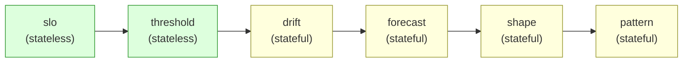
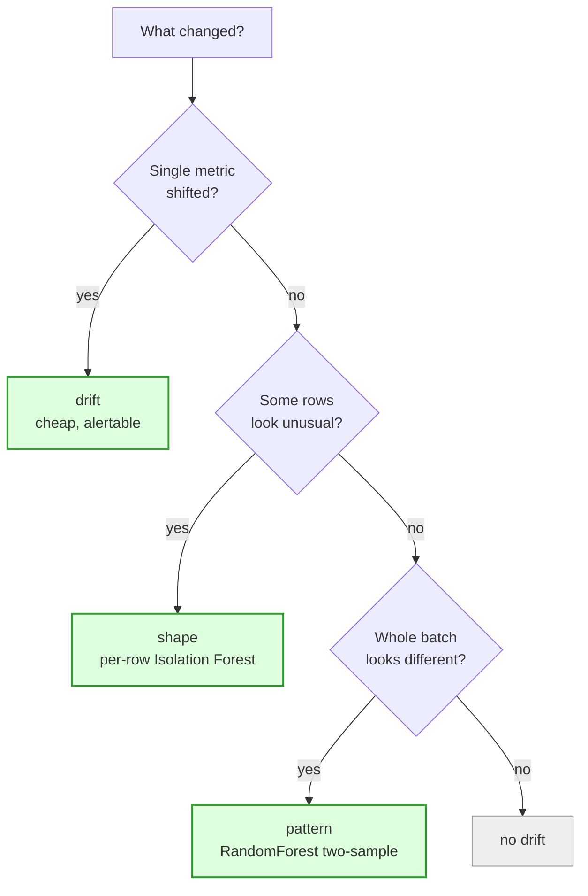

# Validators

Qualifire ships six validator types, all returning
`ValidationResult`(s) with a severity ladder of **PASS → WARNING →
ERROR**. Each validator has its own page in this folder.

| Validator | Purpose | Page |
|---|---|---|
| **SLO** (`slo`) | Data freshness against time-based SLAs | [`slo.md`](slo.md) |
| **Threshold** (`threshold`) | Static bounds on aggregated metrics | [`threshold.md`](threshold.md) |
| **Drift** (`drift`) | Compare current values against persisted history | [`drift.md`](drift.md) |
| **Forecast** (`trend`) | Prophet-based forecasting + adaptive bands | [`forecast.md`](forecast.md) |
| **Shape** (`shape`) | Isolation Forest + SHAP — per-row anomalies | [`shape.md`](shape.md) |
| **Pattern** (`pattern`) | RandomForest two-sample test — batch-level drift | [`pattern.md`](pattern.md) |

Cross-cutting reference:

- [`partition_anchoring.md`](partition_anchoring.md) — `partition_ts`
  and `step` semantics for drift / forecast / anomaly. **Required
  reading** if you want history-backed checks to actually find their
  history.
- [Filter precedence](validator_collector_matrix.md#filter-precedence)
  — when both `DatasetConfig.filter` and a per-collector
  `filter:` are set, qualifire **AND-combines** them (not
  overrides). Pre-2026-05-09 the dataset filter was silently
  dropped; see the linked section for the worked example,
  rendered-empty Jinja contract, and migration shape.

## Complexity ladder

Reading the ladder left-to-right: each validator is cheaper
than the one to its right and answers a coarser question.
Stateful validators read the system table for prior partitions;
stateless validators answer purely from the current run. See
[`../architecture.md`](../architecture.md) §2b for the
read-pattern contract.

## How to choose

> Most pipelines combine **threshold** (catches hard-bound
> breaches) with **either drift or forecast** (catches
> subtle shifts) plus **SLO** (data has to actually arrive).

| Question you're asking | Validator |
|---|---|
| Did the table refresh on time? | `slo` |
| Is the row count above a hard floor? | `threshold` |
| Did `avg_amount` deviate from last week's average by more than 25 %? | `drift` |
| Is today's value outside the seasonally-adjusted prediction band? | `forecast` (Prophet) |
| Are individual rows in today's batch unusual versus past rows? | `shape` |
| Is *the entire batch* drawn from a different distribution than past batches? | `pattern` |

## Decision flowchart — drift vs shape vs pattern

## Three concrete scenarios

**Scenario A — Daily revenue ratio drops 30%.**
Drift on `avg_amount` with `deviation_pct: {min: -20, max: 100}`
catches this on the first day. Cheap, persisted, alertable.
Shape catches it eventually (mean shift makes individual rows
unusual) but needs ≥3 historical slices and is heavier than
needed. Pattern catches it too but takes 5-30s of compute and
N×M memory. **Pick drift.**

**Scenario B — A customer migration silently changes encoding
for non-ASCII names.**
Drift on `avg_name_length` may not move enough to fire. Shape
catches it: the affected rows are a coherent subset, the
anomaly ratio jumps, and SHAP names `customer_name` as the top
contributor. Pattern catches the shift too but does not point
at which rows changed. **Pick shape.**

**Scenario C — A new ETL bug correlates two previously
uncorrelated columns (every row from region X now has product
Y as well).**
Drift on any single metric: invisible. Shape on per-row
scoring: weak signal, the per-column row distribution has not
moved. Pattern: the classifier separates current vs. past
trivially, AUC > 0.9, and SHAP names the correlated pair.
**Pick pattern.**

#### Tradeoff summary

| Validator | State | Cost | Catches | Misses |
|---|---|---|---|---|
| `slo` | none | trivial | freshness | content |
| `threshold` | none | aggregate | hard bounds | drift around the bound |
| `drift` | system table | aggregate | per-metric shifts | seasonality, multivariate |
| `forecast` (`trend`) | system table | Prophet fit | seasonal / trended series | non-stationary structural breaks |
| `shape` | system table sample sentinel + raw rows | Isolation Forest fit | row-level anomalies | "the batch as a whole shifted, no row stands out" |
| `pattern` | system table sample sentinel + raw rows | RandomForest CV | multivariate / correlated drift | "which rows in particular" |

## Programmatic vs YAML

Every validator can be expressed two ways:

- **Programmatic** — `Qualifire.<validator>_check(...)` builder methods
  (see [`../programmatic_api.md`](../programmatic_api.md)).
- **YAML** — `validations:` blocks under `datasets:` in the run config.

Programmatic configs translate 1:1 to YAML through `model_dump()` —
the YAML reference is in [`../configuration.md`](../configuration.md).

## Severity ladder

All validators surface results at three severity levels:

- **PASS** — the check is satisfied (or there's no data to fail
  against, controlled per-validator by `on_missing_history`).
- **WARNING** — soft threshold breached, surfaced through the
  `warning` notify channel by default.
- **ERROR** — hard threshold breached. The engine raises
  `QualifireValidationError` at the end of the run unless the
  caller catches it.

`ValidationResult.details` carries per-validator extras (cold-start
flags, SHAP explanations, prediction bands, ...). Inspect it whenever
you need the *why* behind the severity.

## See also

- [`../programmatic_api.md`](../programmatic_api.md) — public Python
  API surface.
- [`../configuration.md`](../configuration.md) — YAML config
  reference.
- [`../notifications.md`](../notifications.md) — notify channel
  routing.
- [`../profiling.md`](../profiling.md) — profiling collector (used
  by drift / threshold rules built on profile metrics).
- [`../wap_pattern.md`](../wap_pattern.md) — write-audit-publish
  pattern for staging validations before promoting data.
- [`../comparison.md`](../comparison.md) — how Qualifire
  compares to other DQ libraries.
